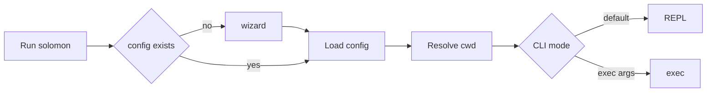
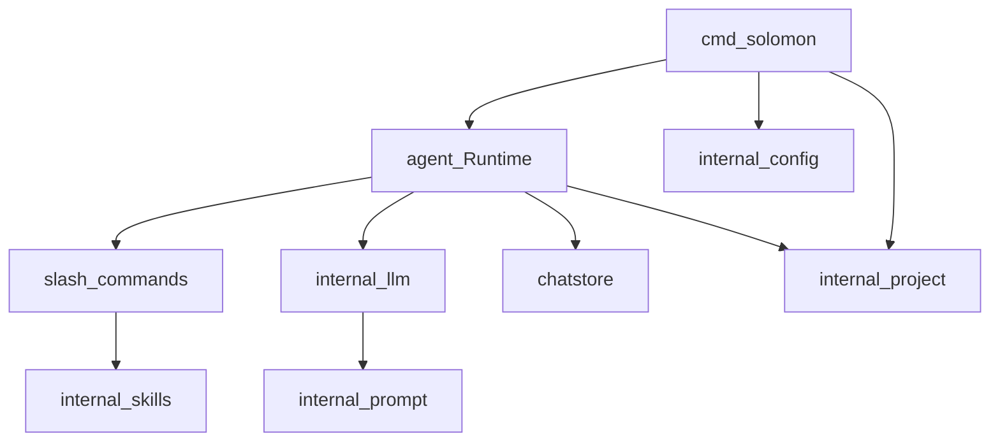

# Solomon

<p align="center">
  
</p>

An interactive terminal harness for working with LLMs over OpenAI-compatible APIs — project-aware sessions, skills, slash commands, planning, and tooling.

## Features

- Interactive readline REPL plus one-shot runs: [`exec`](cmd/solomon/main.go), [`temp exec`](cmd/solomon/main.go)
- Configuration and state under **`~/.solomon`**: [`config.toml`](internal/paths/paths.go), `projects/`, `logs/`, `skills.json`, and project-scoped dirs
- First-run wizard if config is missing: provider display name, base URL, API key, model picker, assistant language ([`RunWizardIfNeeded`](internal/config/config.go))
- **Working directory ↔ project**: stable id derived from cwd, chats and skills partitioned per tree ([`project.Resolve`](internal/project/project.go))
- **Skills**: `solomon add` / `solomon remove` from the shell; `/skills`, `/add`, … in-session (authoritative list: `/help`)

## Compared to

Solomon sits in the “bring your own API” CLI band: one binary, configurable OpenAI-compatible endpoint, transcripts and artefacts on disk. That differs from tightly integrated IDE-hosted agents or subscription-only vendor CLIs, where routing, models, and context are fixed for you. Solomon keeps the boundary explicit — slash commands, separate plan/build tooling, optional subagents — so you decide which backend and workspace you attach to each session.

## Requirements

- [Go](https://go.dev/) **1.24.1** or newer (`go.mod` is the source of truth)
- Network access and credentials for any **OpenAI-compatible** HTTPS API (`base_url` + API key)

## Install

From a clone:

```bash
make build
```

Produces `solomon` (Unix/macOS) or `solomon.exe` (Windows) per [Makefile](Makefile) (`CGO_ENABLED=0`).

Or install straight from the module path (ensure the remote tag you want):

```bash
go install github.com/SAPPHIR3-ROS3/Solomon/cmd/solomon@latest
```

CI verifies `go vet`, `go test`, and `go build ./cmd/solomon`; see [`.github/workflows/release.yml`](.github/workflows/release.yml). Tags are automated on demand — there are **no prebuilt Release binaries** in that workflow unless you extend it.

## Quickstart

```bash
cd /path/to/your/project
solomon
```

If `~/.solomon/config.toml` does not exist, the wizard prompts for setup. Then type natural language at the prompt, or exit and run:

```bash
solomon exec hello
```

`exec` consumes **shell tokenization**: quotes group words for the shell, they are **not** “smart quotes” forwarded into Solomon (`usage` string in [`main.go`](cmd/solomon/main.go)).



## Configuration

Main file: **`~/.solomon/config.toml`**. Typical fields ([`config.Root`](internal/config/config.go)):

| Field | Role |
| --- | --- |
| `current.provider`, `current.model` | Active backend |
| `providers[]` | Named providers (`name`, `base_url`, `api_key`) |
| `user_name` | Shown / used in-session |
| `subagent_timeout_minutes` | Subagent slices (wizard default 20) |
| `reasoning_effort` | Main chat reasoning profile |
| `log_level`, `max_response_tokens` | Verbosity and cap |
| `show_thinking`, `show_usage_stats` | Streams / footer |
| `response_language` | Default reply language |
| `compaction_threshold_tokens` | Auto compaction threshold |

You can edit the file directly or manage providers and models in the REPL with **`/connect`** and **`/models`**.

Logs: **`~/.solomon/logs`** (seven-day retention, file-only by default in [`main.go`](cmd/solomon/main.go)).

## Usage modes

| Mode | Command |
| --- | --- |
| Interactive REPL | `solomon` |
| One shot (persisted chat context) | `solomon exec <prompt>` |
| Ephemeral session | `solomon temp exec <prompt>` |
| Skill install | `solomon add npx ... \| skills.sh \| skill <path/to/.md> [name] [global\|project\|local]` |
| Skill remove | `solomon remove skill <name>` |

Exact usage strings mirror [`cmd/solomon/main.go`](cmd/solomon/main.go).

## Slash commands

Inside the REPL, type **`/help`** for the authoritative, sorted catalogue (mirror of [`commands.Registry`](internal/agent/commands/help.go)).

Highlights: **`/plan`** — planning-only tooling; **`/build`** — build tools (shell, files, subagent); **`/resume`** / **`/new`** — session switching; **`/summarize`** (or **`/compact`**) — long-context hygiene; **`/connect`** — add provider and models.

## Architecture and philosophy

**Philosophy:** local-first data under **`~/.solomon`**, bring-your-own OpenAI-compatible API, cwd-scoped projects (stable id from path), explicit CLI + slash surface, composable skill registry, and optional observability (`show_thinking`, usage footers, on-disk logs).

**Shape:** [`cmd/solomon`](cmd/solomon/main.go) wires wizard/config, resolves the project tree, constructs [`agent.Runtime`](internal/agent/runtime.go). Runtime drives readline IO, slash dispatch ([`slash.go`](internal/agent/slash.go)), chat turns ([`internal/llm`](internal/llm)), persistence ([`chatstore`](internal/chatstore)), prompt templates ([`prompt`](internal/prompt)), skills ([`skills`](internal/skills)), and tooling/plan integrations.



Keep this section short — deep internals belong elsewhere.

## Development

```bash
go vet ./...
go test ./... -count=1
go build ./cmd/solomon
```

Same checks as [.github/workflows/release.yml](.github/workflows/release.yml).

## Releases

Tags are minted manually via **`workflow_dispatch`** on the release workflow. Browse **Tags** on GitHub for chronological versions rather than downloadable `.zip` artefacts from that YAML alone.

## License

[Distributed under the MIT License.](LICENSE)
