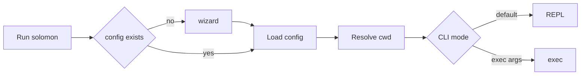

# Solomon

An interactive terminal harness for working with LLMs over OpenAI-compatible APIs — project-aware sessions, skills, slash commands, planning, and tooling.

## Philosophy

Solomon is **local-first**: transcripts, plans, and configuration live under `~/.solomon`, keyed by your workspace. You bring your own **OpenAI-compatible** endpoint (`base_url` + API key) and model; Solomon does not lock you to one vendor or IDE.

It sits in the “BYO API” CLI band: one binary, explicit slash commands, separate **plan** and **build** tool modes, and optional subagents. That differs from IDE-hosted agents or subscription-only CLIs where routing and context are fixed for you — here you choose backend and working directory per session.

Full documentation (configuration, commands, architecture, development): **[docs/](docs/README.md)**.

## Requirements

- [Go](https://go.dev/) **1.24.1** or newer (`go.mod` is the source of truth)
- Network access and credentials for any **OpenAI-compatible** HTTPS API (`base_url` + API key)
- Optional MCP server dependencies for `stdio` or `streamable-http` servers (see [docs](docs/README.md))

## Install

From a clone:

```bash
make build
```

Produces `solomon` (Unix/macOS) or `solomon.exe` (Windows) per [Makefile](Makefile) (`CGO_ENABLED=0`).

Or install from the module path (use the tag you need):

```bash
go install github.com/SAPPHIR3-ROS3/Solomon/cmd/solomon@latest
```

## Quickstart

```bash
cd /path/to/your/project
solomon
```

If `~/.solomon/config.toml` does not exist, the wizard prompts for setup. Then type at the prompt, or run a one-shot message:

```bash
solomon exec hello
```

`exec` uses **shell tokenization**: quotes group words for the shell; they are not passed through as smart quotes to Solomon.



## License

[Distributed under the MIT License.](LICENSE)
