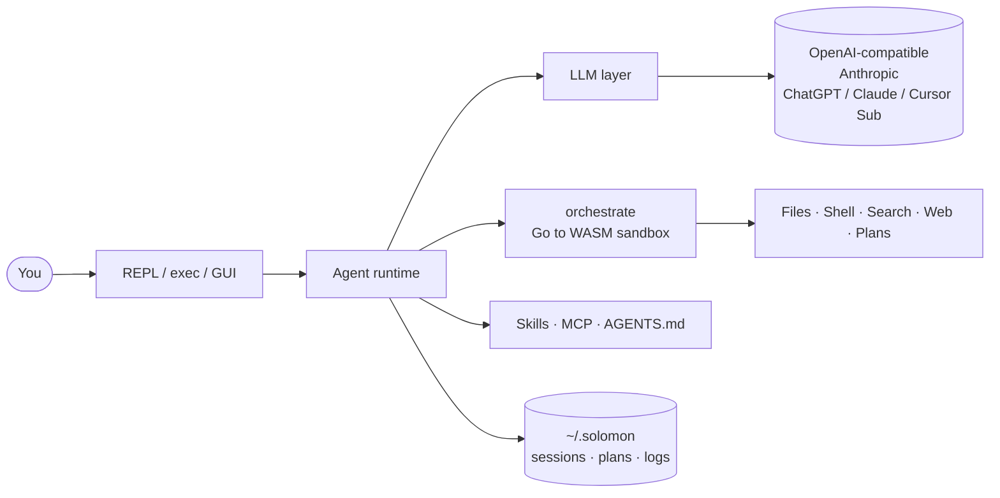

<p align="center">
  
</p>

<h1 align="center">Solomon</h1>

<p align="center">
  <b>A local-first terminal agent for any LLM.</b><br/>
  One Go binary. Your provider, your keys, your workspace.
</p>

<p align="center">
  <a href="https://github.com/SAPPHIR3-ROS3/Solomon/releases"></a>
  <a href="https://go.dev/"></a>
  
  <a href="https://opensource.org/licenses/MIT"></a>
  
</p>

<p align="center">
  <a href="#quickstart">Quickstart</a> ·
  <a href="#features">Features</a> ·
  <a href="#what-makes-it-different">What makes it different</a> ·
  <a href="#how-it-works">How it works</a> ·
  <a href="docs/README.md">Documentation</a>
</p>

> [!WARNING]
> **Early release — preview software, not production-ready.** APIs, behavior, and on-disk formats may change without notice. Expect rough edges and [open an issue](https://github.com/SAPPHIR3-ROS3/Solomon/issues) with feedback.

---

## Why Solomon

Most coding agents are tied to one vendor, one IDE, or one hosted service. Solomon is a **terminal harness** that attaches to your project and talks to whatever model you choose: any OpenAI-compatible endpoint, the Anthropic Messages API, or your existing ChatGPT, Claude, and Cursor subscriptions.

Everything it knows about your work — config, sessions, plans, skills, logs — lives under `~/.solomon`, keyed by workspace, and never inside your repository.

| | |
|---|---|
| **Local-first** | State stays on your machine under `~/.solomon`, partitioned per project |
| **Bring your own model** | OpenAI-compatible APIs, Anthropic, ChatGPT Sub, Claude Sub, Cursor Sub |
| **Code mode** | The agent writes Go scripts that batch file, shell, and search operations in a WASM sandbox |
| **Scriptable** | `solomon exec --jsonl` for pipelines and CI with stable exit codes |
| **Extensible** | Skills, MCP servers, custom rules, and `AGENTS.md` instructions |

## Quickstart

**macOS / Linux**

```bash
curl -fsSL https://raw.githubusercontent.com/SAPPHIR3-ROS3/Solomon/main/scripts/install.sh | bash
```

**Windows (PowerShell)**

```powershell
irm https://raw.githubusercontent.com/SAPPHIR3-ROS3/Solomon/main/scripts/install.ps1 | iex
```

Then open any project and start a session:

```bash
cd /path/to/your/project
solomon .
```

The first run launches an interactive setup for provider, API key, and model. Prefer Go directly? `go install github.com/SAPPHIR3-ROS3/Solomon/v2026/cmd/solomon@latest` — see [Installation and PATH](docs/user-guide/installation.md) for details.

```text
/agent      agent mode: orchestrate, searchTools, subagents
/chat       chat mode: web search, docs, research
/connect    add a provider
/models     switch model
/help       full command list
```

## Features

<table>
<tr>
<td width="50%" valign="top">

### Agent at work
- Read, edit, create, rename, and delete files
- Glob and regexp search in one `find` tool
- Real shell commands with timeouts
- Nested **subagents**, sync or in background
- Durable **plans** with a `buildPlan` handoff

</td>
<td width="50%" valign="top">

### Knowledge and the web
- Web search: DuckDuckGo, SearxNG, Google PSE, Brave, Bing, or Exa/Parallel
- URL fetch with markdown conversion
- **Deep research** jobs with evidence checks and HTML reports
- Embedded docs search with `/docs`

</td>
</tr>
<tr>
<td width="50%" valign="top">

### A REPL built for work
- Multiline input, streaming output, reasoning display
- `@file` mentions and clipboard images
- Checkpoints with `/goto` rewind and branches
- `/btw` side questions while the model streams
- Shell-first mode with `/terminal on`

</td>
<td width="50%" valign="top">

### Beyond the terminal
- `solomon exec` one-shot and ephemeral runs
- `--json` / `--jsonl` output for CI
- Local server for the web GUI and desktop client
- Reachable on loopback, LAN, and Tailscale
- Built-in release updates and config backup

</td>
</tr>
</table>

The full, ranked catalog lives in [docs/features.md](docs/features.md).

## What makes it different

- **Checkpoint rewind** — every turn gets an id like `[#012]`; `/goto` rewinds or forks the transcript instead of starting over.
- **Plans as artifacts** — plans are files with checkable todos, not just a read-only mode.
- **Tool output spill** — oversized results are truncated for the model but saved in full to a local path it can read later.
- **Fail-closed streaming** — inconsistent SSE chunks are rejected so the saved transcript always stays coherent.
- **Dual transcript for skills** — `/skill:name` stays readable in history while the model receives the expanded skill.
- **Safe skill installs** — only `skills add` commands pass, executed as argv and never through `sh -c`.
- **Legacy XML tool calling** — a fallback, or a forced mode, for backends without reliable native function calling.

## How it works


```mermaid
flowchart LR
  user([You]) --> repl[REPL / exec / GUI]
  repl --> runtime[Agent runtime]
  runtime --> llm[LLM layer]
  llm --> providers[(OpenAI-compatible<br/>Anthropic<br/>ChatGPT / Claude / Cursor Sub)]
  runtime --> orch[orchestrate<br/>Go to WASM sandbox]
  orch --> tools[Files · Shell · Search · Web · Plans]
  runtime --> ext[Skills · MCP · AGENTS.md]
  runtime --> store[(~/.solomon<br/>sessions · plans · logs)]
```

Each message starts a turn: Solomon streams the reply, runs any tool calls, feeds the results back, and loops until the model is done. In agent mode the model discovers tools with `searchTools` and chains many operations in one `orchestrate` script, keeping round trips and context usage low. Details: [Architecture overview](docs/architecture/overview.md) and [Agent turn pipeline](docs/architecture/agent-turn-pipeline.md).

## Headless and CI

```bash
solomon exec "summarize the README"
solomon temp exec "explain this stack trace"
solomon exec --jsonl --fail-on-tool-error "run go test ./..."
```

Machine mode writes JSON only to stdout and uses stable exit codes (`0` ok, `3` config, `4` API, `5` tool policy, `6` timeout). A ready-made workflow is in [ci-github-actions.example.yml](docs/development/ci-github-actions.example.yml).

## Build from source

```bash
git clone https://github.com/SAPPHIR3-ROS3/Solomon.git
cd Solomon
make build     # ./solomon
make test      # full test suite
make install   # full local install with integrations
```

## Documentation

| Topic | Where |
|---|---|
| Install | [Installation and PATH](docs/user-guide/installation.md) |
| First steps | [Usage and commands](docs/user-guide/usage-and-commands.md#quickstart) |
| Configuration | [Providers, web search, tools](docs/user-guide/configuration.md) |
| Project instructions | [AGENTS.md and custom rules](docs/user-guide/project-instructions.md) |
| Architecture | [Overview](docs/architecture/overview.md) · [Package index](docs/architecture/package-index.md) |
| Contributing | [Cookbook](docs/development/cookbook.md) · [Testing](docs/development/testing.md) |
| Roadmap | [Planned features](docs/features.md#planned-features-in-the-future) |

## License

Released under the [MIT License](LICENSE).
