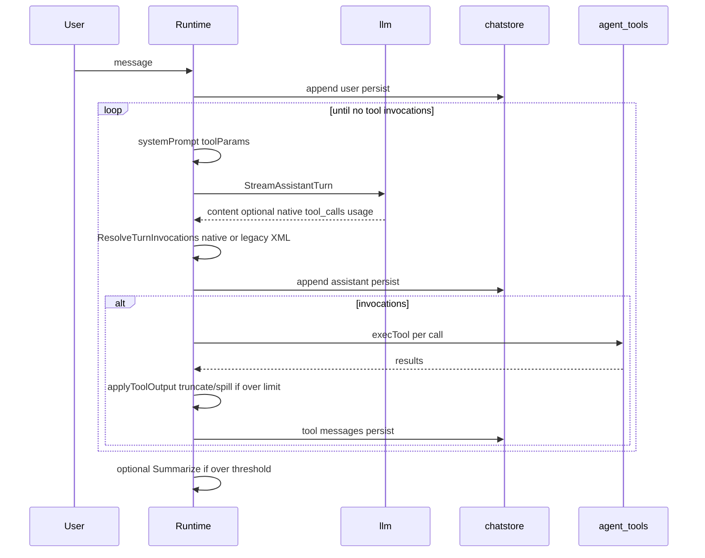

# Agent turn pipeline

## Purpose

After a user message is recorded, Solomon loops: build system prompt and tools → stream assistant → persist → execute tool calls → repeat until the model returns without tools. Optional auto-compaction and usage footers apply.

## Packages and files

| Package / file | Responsibility |
|----------------|----------------|
| `internal/agent/runtime/turns.go` | `onUserMessage`, `runAgentTurns` |
| `internal/agent/runtime/legacy.go` | `ResolveTurnInvocations`, legacy config helpers |
| `internal/tooling/legacy_stream.go`, `legacy_xml.go` | Legacy `<tool_calls>` streaming parser |
| `internal/tooloutput/` | Post-tool output truncation (head/tail, spill to `temp/`) |
| `internal/agent/runtime/ci_run.go` | CI `run_start` / stream events / `run_end` when `EventSink` set |
| `internal/agent/cievents` | Event schema v1, JSONL emitter, JSON collector |
| `internal/agent/runtime/core.go` | `systemPrompt`, `persistSession`, snapshots |
| `internal/agent/runtime/btw/` | Transient `/btw` side questions, output mux, transcript snapshot filtering |
| `internal/agent/runtime/exec.go` | `execTool` → `tools.Exec` |
| `internal/llm/stream/completion.go` | `StreamAssistantTurn` |
| `internal/agent/tools/params.go` | OpenAI tool definitions per mode |
| `internal/agent/commands/summarize.go` | Compaction when over token threshold |

## Key functions

| Function | Behavior |
|----------|----------|
| `onUserMessage` | Shell/`!` bypass; checkpoint bump; append user message; persist; `runAgentTurns` |
| `runAgentTurns` | SIGINT cancel; loop stream + tools until done |
| `systemPrompt` | Plan or build template + tool dump + MCP dump + syntax rules |
| `ResolveTurnInvocations` | Native tool_calls vs legacy XML; rejects native when `[tools].legacy_force` |
| `toolParams` | Native tools for current `Mode` plus MCP tool schemas (empty when legacy force) |
| `llm.StreamAssistantTurn` | SSE stream, accumulator fail-closed, reasoning/content |
| `execTool` | Parse invocation, call `tools.Exec` with `Env` |
| `applyToolOutput` | Truncate oversized tool JSON before persist/LLM (`internal/tooloutput`) |
| `persistSession` | Write `chatstore` JSON when session id exists and not ephemeral |

## Turn loop (sequence)

## Interrupt handling

`runAgentTurns` installs a signal handler that cancels the run context with `errUserStopGeneration`. Partial terminal output may be visible; rejected accumulator chunks are not persisted (`llm.ErrStreamAccumulatorRejected`).

## `/btw` side stream

In interactive non-machine mode, `runAgentTurns` wraps terminal output in `btw.OutputMux` and starts a `/btw` listener. Pressing `/` during streaming switches the mux to buffer main output, restores the terminal to the normal multiline editor with `/btw ` prefilled, and then runs a transient `StreamText` request with `systemPromptBtw` and no tools. The side question is built from a snapshot of completed chat messages and is not appended to `chatstore`.

After the side stream finishes, Solomon waits `btw.CatchUpPause` seconds, unless another `/btw` is queued, then flushes the buffered main output and resumes live streaming. The listener and terminal acquisition live in `internal/agent/runtime/btw/listener` and `internal/agent/runtime/btw/input`. Windows currently has only placeholder readiness for the listener; a real Windows console implementation is still required.

## Machine-readable output (`exec --json` / `--jsonl`)

When `Runtime.EventSink` is set (from `solomon exec` / `temp exec` with `--json` or `--jsonl`), `runAgentTurns` emits structured events instead of ANSI transcript lines: `assistant_start`, `assistant_delta` (via `llm.StreamOpts.OnDelta`), `assistant_end`, `tool_start`, `tool_result`, then `run_end` with exit metadata. Subagent timeout in this mode returns exit code `6` without prompting on stdin. See [Usage and commands — machine output](../user-guide/usage-and-commands.md#machine-readable-output---json---jsonl) and [Startup and CLI](startup-and-cli.md).

## Deferred chat title

When the session id is still a placeholder after the first turn, `scheduleDeferredChatTitleFinalize` runs a background title generation pass (`deferred_chat_title.go`).

## Legacy XML tool calling

When `[tools].legacy` is enabled in config (or toggled with `/legacytools`), the assistant may emit tool invocations as a `<tool_calls>` XML block in streamed text instead of native API `tool_calls`. `LegacyStreamWriter` buffers the block during streaming, formats output like native tools (intent line, then `Tool:` line), and stops the stream at `</tool_calls>`.

| Mode | API `Tools` in request | Resolution |
|------|------------------------|------------|
| default | native schemas | native `tool_calls` only |
| `[tools].legacy = true` | native schemas | native preferred; XML parsed if no native calls |
| `[tools].legacy_force = true` | empty | native rejected; XML required |

Malformed XML, invalid JSON in `<args>`, or unknown tool names interrupt the stream, show a system error, and inject a correction user message for retry. Tool names are validated against the active native + MCP set for the current mode.

See [Configuration — `[tools]`](../user-guide/configuration.md#tools-legacy-xml-tool-calling) and [Native tools](native-tools.md).

## Nested agents

The `subagent` tool calls [`nested.go`](../../internal/agent/runtime/nested.go) for an isolated nested stream. Detail: [Runtime — orchestration](runtime-orchestration.md#nested-subagent).

| Step | Behavior |
|------|----------|
| Entry | `tools/subagent` → `Runtime.runNested` or `runNestedWithSystem` |
| Prompt | Build-mode template by default; optional custom `sysPromptPath` merged with inherited instructions |
| Tools | Build tool dump + MCP dump; legacy syntax appended when `[tools].legacy` and not full build template |
| Result | Consolidated string returned to parent tool message (subchat files optional) |

Subchat persistence: [Sessions and storage](sessions-and-storage.md).

## Tool output limits

After each tool returns, `applyToolOutput` (via [`internal/tooloutput/`](../../internal/tooloutput/)) serializes the result and, when it exceeds configured **byte** or **line** thresholds (defaults: 64 KiB, 2048 lines), returns a `---TRUNCATED---` block with `full output at <path>` and writes the full payload to `projects/<project-id>/temp/`. Spill cleanup runs when the **last** Solomon process exits; if other instances are still running, the project id is appended to `~/.solomon/temp.txt` (only when this session produced a spill). Optional overrides: `[tool_output]` in `config.toml`. `readFile` accepts optional `startLine` / `endLine` (1-based) for line-range reads before truncation runs. Details: [Supporting packages — Tool output spill](supporting-packages.md#tool-output-spill). Tests: [`test/tooloutput_test.go`](../../test/tooloutput_test.go).

## Extension points

- New tool: implement in `internal/agent/tools/`, register in `params.go` and `exec.go` mode guards.
- Compaction: `compaction_threshold_tokens` in config; slash `/summarize`.

## Related code

- [`internal/agent/runtime/turns.go`](../../internal/agent/runtime/turns.go)
- [`internal/llm/stream/completion.go`](../../internal/llm/stream/completion.go)
- [`internal/tooloutput/service.go`](../../internal/tooloutput/service.go)

## See also

- [LLM layer](llm-layer.md)
- [Native tools](native-tools.md)
- [Plan vs build](plan-vs-build.md)
- [Checkpoints](checkpoints.md)
