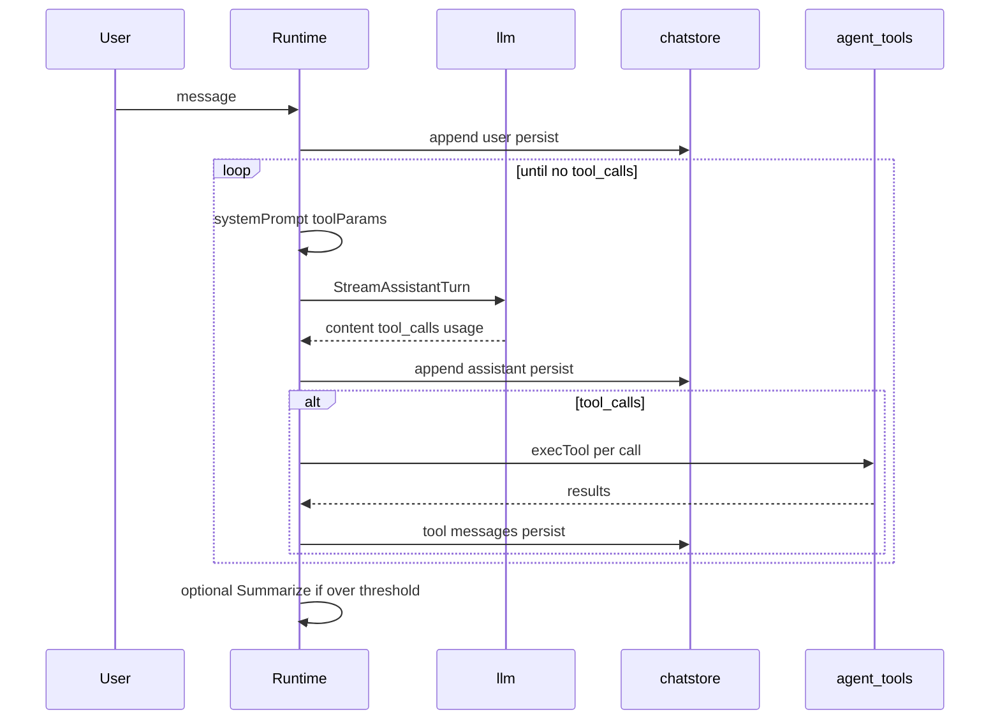

# Agent turn pipeline

## Purpose

After a user message is recorded, Solomon loops: build system prompt and tools → stream assistant → persist → execute tool calls → repeat until the model returns without tools. Optional auto-compaction and usage footers apply.

## Packages and files

| Package / file | Responsibility |
|----------------|----------------|
| `internal/agent/runtime/turns.go` | `onUserMessage`, `runAgentTurns` |
| `internal/agent/runtime/ci_run.go` | CI `run_start` / stream events / `run_end` when `EventSink` set |
| `internal/agent/cievents` | Event schema v1, JSONL emitter, JSON collector |
| `internal/agent/runtime/core.go` | `systemPrompt`, `persistSession`, snapshots |
| `internal/agent/runtime/exec.go` | `execTool` → `tools.Exec` |
| `internal/llm/stream.go` | `StreamAssistantTurn` |
| `internal/agent/tools/params.go` | OpenAI tool definitions per mode |
| `internal/agent/commands/summarize.go` | Compaction when over token threshold |

## Key functions

| Function | Behavior |
|----------|----------|
| `onUserMessage` | Shell/`!` bypass; checkpoint bump; append user message; persist; `runAgentTurns` |
| `runAgentTurns` | SIGINT cancel; loop stream + tools until done |
| `systemPrompt` | Plan or build template + tool dump + MCP dump + syntax rules |
| `toolParams` | Native tools for current `Mode` plus MCP tool schemas |
| `llm.StreamAssistantTurn` | SSE stream, accumulator fail-closed, reasoning/content |
| `execTool` | Parse invocation, call `tools.Exec` with `Env` |
| `persistSession` | Write `chatstore` JSON when session id exists and not ephemeral |

## Turn loop (sequence)

## Interrupt handling

`runAgentTurns` installs a signal handler that cancels the run context with `errUserStopGeneration`. Partial terminal output may be visible; rejected accumulator chunks are not persisted (`llm.ErrStreamAccumulatorRejected`).

## Machine-readable output (`exec --json` / `--jsonl`)

When `Runtime.EventSink` is set (from `solomon exec` / `temp exec` with `--json` or `--jsonl`), `runAgentTurns` emits structured events instead of ANSI transcript lines: `assistant_start`, `assistant_delta` (via `llm.StreamOpts.OnDelta`), `assistant_end`, `tool_start`, `tool_result`, then `run_end` with exit metadata. Subagent timeout in this mode returns exit code `6` without prompting on stdin. See [Usage and commands — machine output](../user-guide/usage-and-commands.md#machine-readable-output---json---jsonl) and [Startup and CLI](startup-and-cli.md).

## Deferred chat title

When the session id is still a placeholder after the first turn, `scheduleDeferredChatTitleFinalize` runs a background title generation pass (`deferred_chat_title.go`).

## Nested agents

`subagent` tool and `runtime/nested.go` run a nested stream with a separate system prompt and return a string to the parent tool result (subchat files optional; see [Sessions and storage](sessions-and-storage.md)).

## Extension points

- New tool: implement in `internal/agent/tools/`, register in `params.go` and `exec.go` mode guards.
- Compaction: `compaction_threshold_tokens` in config; slash `/summarize`.

## Related code

- [`internal/agent/runtime/turns.go`](../../internal/agent/runtime/turns.go)
- [`internal/llm/stream.go`](../../internal/llm/stream.go)

## See also

- [LLM layer](llm-layer.md)
- [Native tools](native-tools.md)
- [Plan vs build](plan-vs-build.md)
- [Checkpoints](checkpoints.md)
