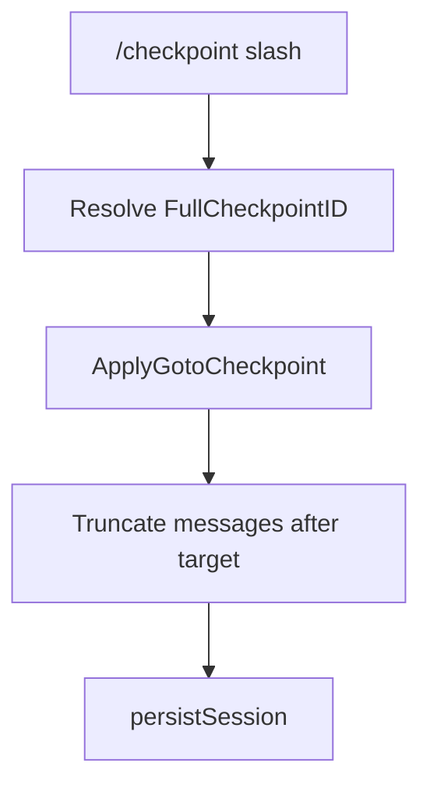

# Checkpoints

## Purpose

Version messages within a session with checkpoint sequences and branch suffixes; support goto/truncate flows and REPL prompt prefixes; optional git commit OID sync on the session record.

## Packages and files

| Package / file | Responsibility |
|----------------|----------------|
| `internal/checkpoint/` | `Bump`, `StampMsg`, labels, truncate, full id types |
| `internal/agent/runtime/checkpoint.go` | `ApplyGotoCheckpoint`, staging |
| `internal/agent/commands/checkpoint_cmds.go` | Slash checkpoint UX |
| `internal/chatstore/checkpoint_sync.go` | `LastCommitOID` sync |

## Key functions

| Function | Behavior |
|----------|----------|
| `checkpoint.Bump` | Advance `CheckpointLast` on user message |
| `checkpoint.StampMsg` | Attach seq/branch to message |
| `FormatReplPromptPrefix` | `You: ` prompt shows next checkpoint tag |
| `FormatLinePrefix` | Prefix on echoed user/assistant lines |
| `Runtime.ApplyGotoCheckpoint` | Restore staged workspace files then rewind session to a checkpoint id |

## Checkpoint display

Tags look like `[#012]` or `[#012b]` when a branch suffix is active (`FormatCheckpointTag`).
Tool and transcript output keeps the checkpoint tag on the first visual row; wrapped or multiline continuation rows use the checkpoint continuation gutter instead of repeating the full tag. Terminal-aware wrapping also accounts for the live output descriptor when output is routed through the runtime mux.

## Goto flow (conceptual)

Exact slash names and branch rules: [`checkpoint_cmds.go`](../../internal/agent/commands/checkpoint_cmds.go).

## File staging

`editFile` calls record a per-session staging log under `chats/<session-id>/staging/` (baselines on first touch, operations tagged with checkpoint seq). `ApplyGotoCheckpoint` replays baselines and ops up to the target seq on the project root before truncating the transcript. Shell mutations are not staged in v1.

## Git OID

`Session.LastCommitOID` can be updated from workspace git state for correlation with checkpoints (`checkpoint_sync.go`, runtime staging hooks).

## Extension points

- New checkpoint operations: extend `checkpoint` package and slash commands together.

## Related code

- [`internal/checkpoint/label.go`](../../internal/checkpoint/label.go)
- [`internal/agent/runtime/checkpoint.go`](../../internal/agent/runtime/checkpoint.go)

## See also

- [Sessions and storage](sessions-and-storage.md)
- [Runtime and REPL](runtime-and-repl.md)
