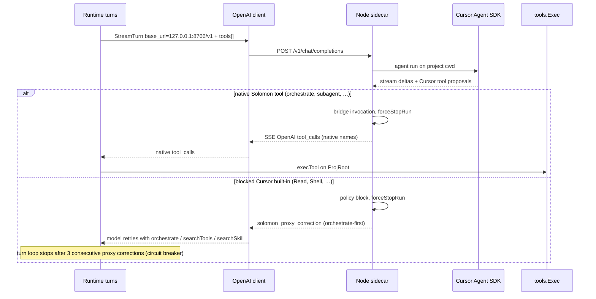

# Cursor integration

## Purpose

Optional **Cursor API** provider: Solomon talks to a local **Node sidecar** (OpenAI-compatible HTTP), the sidecar drives the **Cursor Agent SDK**, and — by default — **Solomon Go** executes all tools on the real project root.

User setup (TOML, `/connect`, `/integrations`, `/cursortools`): [Configuration — Cursor integration](../user-guide/configuration.md#cursor-integration-tool-execution).

Product requirements and full policy tables: [`CURSOR-PROXY-FIX.md`](../../CURSOR-PROXY-FIX.md).

## Mental model

```
Solomon Runtime  --OpenAI HTTP-->  sidecar (:8766/v1/)  --Cursor SDK-->  remote model
       |                                    |
       +-------- tools.Exec (Go) -----------+  (orchestrate-first proxy: default)
```

- **Sidecar** = policy gate + stream bridge (`integrations/cursor/`).
- **Go integration** = install bundle, start process, health, `/integrations` (`internal/integrations/cursor/`).
- **Executor** = always Solomon `tools.Exec` on `ProjRoot`. `cursor_internal_tools` is **deprecated and forced off** — Cursor built-ins never run on the repo.

Composer is steered toward **Solomon native entry tools** (`orchestrate`, `searchTools`, `subagent`, …). Cursor IDE built-ins (`Read`, `StrReplace`, `Shell`, `Task`, …) are **blocked** and corrected — not bridged to deferred `readFile` / `editFile` / `shell` `tool_calls`. Workspace read/edit/shell/find/MCP work goes through **`orchestrate`** (sandbox SDK inside Go code mode).

## End-to-end flow



Sidecar startup: [`manager.go`](../../internal/integrations/cursor/manager.go) spawns `node dist/index.js` with env from config. Runtime ensures sidecar via [`cursor_sidecar.go`](../../internal/agent/runtime/cursor_sidecar.go) → [`agent/runtime.go`](../../internal/integrations/cursor/agent/runtime.go).

## Operating modes

| Mode | Agent `cwd` | Who runs file/shell tools on repo |
|------|-------------|-----------------------------------|
| **Production (only supported path)** | project root | **Solomon Go** only |

`[tools].cursor_internal_tools` is **deprecated**: config load/save normalizes it to `false`, `CursorInternalToolsEnabled()` always returns `false`, and `/cursortools on` is rejected. Solomon never sets `CURSOR_API_ALLOW_INTERNAL_TOOLS=true` on the sidecar.

Use **`/cursortools off`** (or bare `/cursortools`) to confirm the setting and restart the sidecar. Implementation: [`thinking.go`](../../internal/agent/commands/thinking.go) (`CursorTools`). Inspect status: `/integrations` ([`integrations_slash.go`](../../internal/agent/commands/integrations_slash.go)).

## Orchestrate-first proxy (default)

### Native tool exposure

**Mechanism:** SDK `local.customTools` + Go execution prehook — prompt XML remains a fallback.

| Layer | Role |
|-------|------|
| Go system prompt | [`agent.tmpl`](../../internal/prompt/templates/agent.tmpl) `ExternalToolBridge` — lists native entry tools, blocks Cursor built-ins |
| Sidecar harness | [`harness-clauses.txt`](../../integrations/cursor/prompts/harness-clauses.txt), [`harness-prompt.ts`](../../integrations/cursor/src/harness-prompt.ts) — orchestrate-first workflow; Solomon tools are real registered tools |
| OpenAI `tools[]` on request | Converted to SDK `customTools` via [`custom-tools.ts`](../../integrations/cursor/src/custom-tools.ts) (`openAIToolsToMcpTools`) |
| Model invocation | Composer calls registered tool names (`orchestrate`, `searchTools`, …) as native `tool_calls` or MCP `custom-user-tools` |
| Prehook / bridge | [`stream-events.ts`](../../integrations/cursor/src/chat/helpers/stream-events.ts) intercepts `solomon` and `custom-user-tools` MCP calls → `forceStopRun` → OpenAI `tool_calls` to Go; stub `execute` in Node must not run workspace work |
| Fallback wire | `<tool_calls>` XML still parsed by [`openai-tools.ts`](../../integrations/cursor/src/openai-tools.ts) when the model emits text blocks |

`Agent.create` in [`cursor-agent.ts`](../../integrations/cursor/src/cursor-agent.ts) registers `local.customTools` from the request `tools[]`. Execution always happens in Go (`tools.Exec` on `ProjRoot`), not in the sidecar process.

### Policy gate

Central module: [`tool-policy.ts`](../../integrations/cursor/src/tool-policy.ts). Applied on stream and non-stream paths ([`chat/stream.ts`](../../integrations/cursor/src/chat/stream.ts), [`chat/nonstream.ts`](../../integrations/cursor/src/chat/nonstream.ts)) via [`finalizeTurnToolResults`](../../integrations/cursor/src/chat/turn.ts).

| Class | Examples | Sidecar action |
|-------|----------|----------------|
| **Native pass-through** | `orchestrate`, `searchTools`, `subagent`, `listSubAgents`, `switchMode`, `searchSkill`, `loadSkill` | Bridge → OpenAI `tool_calls` → Go `tools.Exec` |
| **Block — redirect** | `Read`, `StrReplace`, `Shell`, `Grep`, `Task`, `WebFetch`, deferred `mcp:editFile`, … | `solomon_proxy_correction` → `searchTools` + `orchestrate`; **no** bridge to `readFile`/`editFile`/`shell` |
| **Hard deny** | `AskQuestion`, `browser_*`, `mcp:external`, `GenerateImage`, `Await`, `ApplyPatch` | Deny with class-specific correction; no host execution |

Full mapping tables: [`CURSOR-PROXY-FIX.md` §3](../../CURSOR-PROXY-FIX.md#tool-policy). Matrix tests: [`policy-matrix.test.ts`](../../integrations/cursor/test/policy-matrix.test.ts).

### Run control

On bridged native invocation or policy-blocked tool, the sidecar calls **`forceStopRun`** so the Cursor SDK does not continue executing tools on disk ([`stream-loop.ts`](../../integrations/cursor/src/chat/helpers/stream-loop.ts), [`run-control.ts`](../../integrations/cursor/src/run-control.ts)). SDK sandbox remains a secondary layer when enabled.

Correction copy (orchestrate-first, names `searchTools`, `orchestrate`, `searchSkill`, `loadSkill`): [`proxy-correction.ts`](../../integrations/cursor/src/chat/helpers/proxy-correction.ts). Go-side mirror: [`tool_print.go`](../../internal/agent/runtime/tool_print.go).

### Proxy correction circuit breaker

If Composer emits **more than three consecutive proxy corrections** in one user turn (blocked Cursor built-in with no successful native tool invocation in between), the Go turn loop stops retrying and prints a system bailout message ([`turnloop/loop.go`](../../internal/agent/runtime/turnloop/loop.go)). This prevents infinite correction loops while keeping the REPL usable.

## HTTP API (sidecar)

Base URL: `http://127.0.0.1:8766/v1/` (port from [`DefaultPort`](../../internal/integrations/cursor/pathresolver.go), overridable via env).

| Method | Path | Role |
|--------|------|------|
| `GET` | `/health`, `/v1/health` | Liveness (`{ ok: true }`) |
| `GET` | `/v1/models`, `/models` | Model list for picker |
| `GET` | `/v1/models?all=1` | Full model list |
| `POST` | `/v1/chat/completions`, `/chat/completions` | Chat completion proxy |

Implementation: [`server.ts`](../../integrations/cursor/src/server.ts). Request limits: body 8 MiB, 256 messages, 64 tools (see server constants).

### Sidecar environment

Set by Go when starting the process ([`manager.go`](../../internal/integrations/cursor/manager.go)):

| Variable | Role |
|----------|------|
| `CURSOR_API_KEY` | Cursor API key from provider config |
| `CURSOR_API_PORT` | Listen port (default `8766`) |
| `CURSOR_API_CWD` | Project root |
| `CURSOR_API_ALLOW_INTERNAL_TOOLS` | Always omitted / `false` (`cursor_internal_tools` deprecated) |
| `CURSOR_API_PROXY_OBS` | `"1"` — Solomon sets this when starting the sidecar (structured proxy JSON on stderr) |

Optional overrides:

| Variable | Role |
|----------|------|
| `SOLOMON_NODE` | Path to `node` binary |
| `SOLOMON_CURSOR_API_ROOT` | Override install dir ([`pathresolver.go`](../../internal/integrations/cursor/pathresolver.go)) |

Logs: `~/.solomon/logs/cursor-sidecar.log` (stdout/stderr from the sidecar process).

### Observability

[`proxy-observability.ts`](../../integrations/cursor/src/proxy-observability.ts) records per-turn counters (native bridged vs blocked by policy class, correction streaks, deferred-direct blocks). With Solomon-managed sidecar startup, structured `proxy_turn` / `proxy_correction_loop` JSON lines are written to `cursor-sidecar.log` automatically. Disable only by running the sidecar outside Solomon without `CURSOR_API_PROXY_OBS`.

## Install and lifecycle

| Step | Where |
|------|------|
| Embed + extract bundle | [`bootstrap.go`](../../internal/integrations/cursor/bootstrap.go), [`embed.go`](../../internal/integrations/cursor/embed.go) |
| Install dir | `~/.solomon/integrations/cursor/` (`dist/index.js`, `node_modules/@cursor/sdk`) |
| First use / missing SDK | `Bootstrap` runs `npm` prod deps |
| Process manager | [`manager.go`](../../internal/integrations/cursor/manager.go) — singleton, health poll, restart on key change |
| Build from source | `npm --prefix integrations/cursor run build` then `go run scripts/cursor_bundler.go bundle` (CI / `make build`) |

Entry: [`integrations/cursor/src/index.ts`](../../integrations/cursor/src/index.ts).

## Go package map

| File | Role |
|------|------|
| [`pathresolver.go`](../../internal/integrations/cursor/pathresolver.go) | Install dir, default base URL, entry script path |
| [`bootstrap.go`](../../internal/integrations/cursor/bootstrap.go) | Extract embedded bundle, npm deps |
| [`manager.go`](../../internal/integrations/cursor/manager.go) | Start/stop sidecar, health, `ProxyStatus` |
| [`sidecar_async.go`](../../internal/integrations/cursor/sidecar_async.go) | Async kick/wait when Cursor provider active |
| [`ensure_configured.go`](../../internal/integrations/cursor/ensure_configured.go) | Wait for sidecar if configured |
| [`agent/runtime.go`](../../internal/integrations/cursor/agent/runtime.go) | `EnsureSidecar` from runtime |
| [`models.go`](../../internal/integrations/cursor/models.go) | Model list via sidecar HTTP |

Runtime display when native tools enabled: [`cursor_native_display.go`](../../internal/agent/runtime/cursor_native_display.go).

## Node package map

| File | Role |
|------|------|
| [`server.ts`](../../integrations/cursor/src/server.ts) | HTTP router, request validation |
| [`chat/index.ts`](../../integrations/cursor/src/chat/index.ts) | Chat completions entry |
| [`chat/stream.ts`](../../integrations/cursor/src/chat/stream.ts) | Streaming completion path |
| [`chat/nonstream.ts`](../../integrations/cursor/src/chat/nonstream.ts) | Non-streaming completion path |
| [`chat/turn.ts`](../../integrations/cursor/src/chat/turn.ts) | Turn finalization, proxy correction resolution |
| [`chat/helpers/stream-loop.ts`](../../integrations/cursor/src/chat/helpers/stream-loop.ts) | SDK stream drain, `forceStopRun` |
| [`chat/helpers/stream-events.ts`](../../integrations/cursor/src/chat/helpers/stream-events.ts) | Per-event policy enforcement |
| [`chat/helpers/proxy-correction.ts`](../../integrations/cursor/src/chat/helpers/proxy-correction.ts) | `solomon_proxy_correction` text |
| [`tool-policy.ts`](../../integrations/cursor/src/tool-policy.ts) | Block / redirect / hard-deny policy |
| [`proxy-observability.ts`](../../integrations/cursor/src/proxy-observability.ts) | Turn counters and optional JSON logs |
| [`bridge/invocation.ts`](../../integrations/cursor/src/bridge/invocation.ts) | Native tool bridging |
| [`legacy.ts`](../../integrations/cursor/src/legacy.ts) | Re-exports bridge + legacy alias map |
| [`legacy-normalize.ts`](../../integrations/cursor/src/legacy-normalize.ts) | Argument normalization (legacy paths) |
| [`openai-tools.ts`](../../integrations/cursor/src/openai-tools.ts) | OpenAI `tool_calls` SSE, XML parsing, `openAIToolsToMcpTools` |
| [`custom-tools.ts`](../../integrations/cursor/src/custom-tools.ts) | OpenAI tools → SDK `customTools`; Node `execute` stub (Go owns work) |
| [`openai-sse.ts`](../../integrations/cursor/src/openai-sse.ts) | SSE chunks |
| [`cursor-agent.ts`](../../integrations/cursor/src/cursor-agent.ts) | SDK agent create (sandbox, harness) |
| [`cursor-native-tools.ts`](../../integrations/cursor/src/cursor-native-tools.ts) | `solomon_cursor_tool_event` chunks |
| [`harness-prompt.ts`](../../integrations/cursor/src/harness-prompt.ts) | Orchestrate-first harness clauses |
| [`run-control.ts`](../../integrations/cursor/src/run-control.ts) | Abort, usage, `forceStopRun` |

## Legacy alias map

[`tool-policy.ts`](../../integrations/cursor/src/tool-policy.ts) `CURSOR_NATIVE_ALIASES` (also in [`legacy.ts`](../../integrations/cursor/src/legacy.ts)) documents how Cursor names *would* map to Solomon deferred tools. Under orchestrate-first policy, **redirect-class Cursor tools are not bridged** — the map drives correction hints and tests, not transparent `Read` → `readFile` handoff.

Native MCP unwrap (`mcp` provider `solomon`): deferred tool names in MCP calls are blocked; native entry tools (e.g. `subagent`) still pass through when allowed.

### Tool name bridge

[`CURSOR_NATIVE_ALIASES`](../../integrations/cursor/src/tool-policy.ts) maps Cursor search/list names to Solomon `find`: `Grep`, `Glob`, `SemanticSearch`, `ListDir`, `rg`, and similar → `find`. `SemanticSearch` uses regexp fallback today (no vector index). Under orchestrate-first policy, redirect-class Cursor tools are corrected toward `orchestrate` rather than bridged transparently; the alias map still drives tests and legacy paths when internal tools are enabled.

## SSE extensions

| Field | When | Consumer |
|-------|------|----------|
| `solomon_proxy_correction` | Blocked Cursor / deferred-direct tool | Model retry guidance (orchestrate-first) |
| `solomon_cursor_tool_event` | Deprecated (`cursor_internal_tools` removed) | Was REPL display when Cursor ran tools on disk |

Native event shape: [`cursor-native-tools.ts`](../../integrations/cursor/src/cursor-native-tools.ts) (`name`, `status`, `args`, `result`, `error`).

## Limits and caveats

- Policy enforcement + `forceStopRun` is the primary execution gate; SDK sandbox is secondary when enabled.
- Chat mode with Cursor provider is **Phase 3** — agent orchestrate-first is MVP ([`CURSOR-PROXY-FIX.md`](../../CURSOR-PROXY-FIX.md)).
- Guarantees depend on sidecar + Cursor SDK versions (`@cursor/sdk` 1.0.20+ for `customTools`).
- Requires **Node.js** when Cursor provider is enabled.
- Manual check after upgrades: Composer should call registered Solomon tools by name; `Read`/`StrReplace` attempts should yield one correction then recovery via `orchestrate` / `searchTools`.

## Debug playbook

| Symptom | Start here | Tests |
|---------|------------|-------|
| Sidecar won't start | [`manager.go`](../../internal/integrations/cursor/manager.go), [`bootstrap.go`](../../internal/integrations/cursor/bootstrap.go), `~/.solomon/logs/cursor-sidecar.log` | [`test/cursor_paths_test.go`](../../test/cursor_paths_test.go) |
| `/integrations` health fail | Port 8766, `CURSOR_API_KEY`, firewall | — |
| Cursor tool ran on repo (policy bug) | [`tool-policy.ts`](../../integrations/cursor/src/tool-policy.ts), `forceStopRun` in [`stream-loop.ts`](../../integrations/cursor/src/chat/helpers/stream-loop.ts) | [`policy-matrix.test.ts`](../../integrations/cursor/test/policy-matrix.test.ts) |
| Correction loop (>3 same class) | Inspect `proxy_correction_loop` / `proxy_turn` JSON in `cursor-sidecar.log`; Go bailout in [`turnloop/loop.go`](../../internal/agent/runtime/turnloop/loop.go) | [`proxy-observability.test.ts`](../../integrations/cursor/test/proxy-observability.test.ts) |
| Model still tries Read/StrReplace | [`harness-prompt.ts`](../../integrations/cursor/src/harness-prompt.ts), [`proxy-correction.ts`](../../integrations/cursor/src/chat/helpers/proxy-correction.ts), Go [`tool_print.go`](../../internal/agent/runtime/tool_print.go) | [`openai-tools-mapping.test.ts`](../../integrations/cursor/test/openai-tools-mapping.test.ts) |
| No REPL display for native tools | [`cursor_native_display.go`](../../internal/agent/runtime/cursor_native_display.go) | [`test/cursor_native_display_test.go`](../../test/cursor_native_display_test.go) |
| Provider config / base URL | [`config`](../../internal/config/config.go), `/connect` Cursor flow | [`test/config_provider_cursor_test.go`](../../test/config_provider_cursor_test.go) |

## See also

- [`CURSOR-PROXY-FIX.md`](../../CURSOR-PROXY-FIX.md) — product requirements, policy tables, roadmap
- [Configuration — Cursor integration](../user-guide/configuration.md#cursor-integration-tool-execution)
- [Native tools](native-tools.md)
- [Runtime — orchestration](runtime-orchestration.md#cursor-integration-runtime-hooks)
- [MCP integration](mcp-integration.md)
- [`integrations/cursor/`](../../integrations/cursor/)
