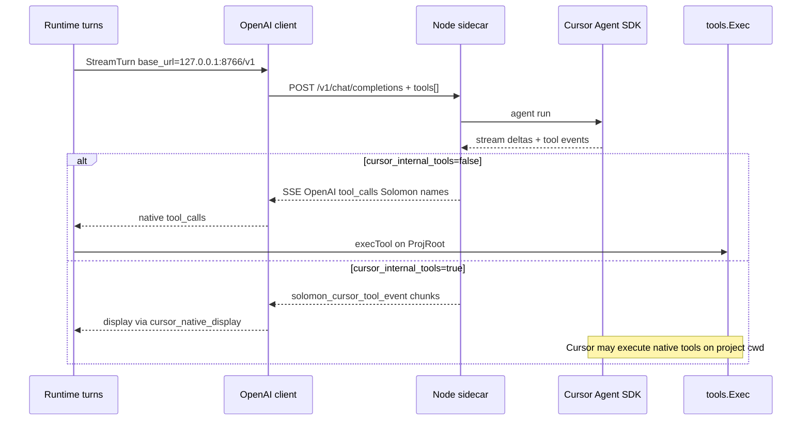

# Cursor integration

## Purpose

Optional **Cursor API** provider: Solomon talks to a local **Node sidecar** (OpenAI-compatible HTTP), the sidecar drives the **Cursor Agent SDK**, and — by default — **Solomon Go** executes all tools on the real project root.

User setup (TOML, `/connect`, `/integrations`, `/cursortools`): [Configuration — Cursor integration](../user-guide/configuration.md#cursor-integration-tool-execution).

## Mental model

```
Solomon Runtime  --OpenAI HTTP-->  sidecar (:8766/v1/)  --Cursor SDK-->  remote model
       |                                    |
       +-------- tools.Exec (Go) -----------+  (bridge only; default: no repo access in SDK)
```

- **Sidecar** = thin proxy + stream bridge (`integrations/cursor/`).
- **Go integration** = install bundle, start process, health, `/integrations` (`internal/integrations/cursor/`).
- **Executor** = always Solomon `tools.Exec` on `ProjRoot` when `cursor_internal_tools = false` (default).

## End-to-end flow



Sidecar startup: [`manager.go`](../../internal/integrations/cursor/manager.go) spawns `node dist/index.js` with env from config. Runtime ensures sidecar via [`cursor_sidecar.go`](../../internal/agent/runtime/cursor_sidecar.go) → [`agent/runtime.go`](../../internal/integrations/cursor/agent/runtime.go).

## Operating modes

| `[tools].cursor_internal_tools` | Agent `cwd` | Deny hooks | Who runs file/shell tools on repo |
|--------------------------------|-------------|------------|-----------------------------------|
| **`false`** (default, omit) | `<project>/.solomon-cursor-guard/` | yes | **Solomon Go** only |
| **`true`** | project root | no | **Cursor SDK** (native tools) |

Recommended production default: **`false`**. Solomon sets sidecar env `CURSOR_API_ALLOW_INTERNAL_TOOLS=true` only when config is `true`.

Toggle in-session: `/cursortools on|off` (listed in `/help` only when Cursor API is configured). Implementation: [`thinking.go`](../../internal/agent/commands/thinking.go) (`CursorTools`). Inspect status: `/integrations` ([`integrations_slash.go`](../../internal/agent/commands/integrations_slash.go)).

## Fail-closed stack (`cursor_internal_tools = false`)

Layers (see [`cursor-agent.ts`](../../integrations/cursor/src/cursor-agent.ts), [`chat.ts`](../../integrations/cursor/src/chat.ts)):

1. **Deny hooks** — `.solomon-cursor-guard/.cursor/hooks.json` rejects `Shell|Read|Write|Edit|Grep|Glob|Delete|Task` with `permission: deny`, `failClosed: true`.
2. **Guard workspace** — SDK agent `cwd` is `.solomon-cursor-guard/` under the project, not the repo tree.
3. **MCP `solomon` stub** — exposes schemas from the request; `tools/call` does not execute on disk.
4. **Stream bridge** — map Cursor tool events → Solomon names → OpenAI `tool_calls` SSE; stop Cursor run (`forceStopRun`); block unmapped tools with `solomon_proxy_correction`.

Solomon then runs `readFile`, `shell`, `editFile`, etc. on **`ProjRoot`**.

## HTTP API (sidecar)

Base URL: `http://127.0.0.1:8766/v1/` (port from [`DefaultPort`](../../internal/integrations/cursor/paths.go), overridable via env).

| Method | Path | Role |
|--------|------|------|
| `GET` | `/health`, `/v1/health` | Liveness (`{ ok: true }`) |
| `GET` | `/v1/models`, `/models` | Model list for picker |
| `GET` | `/v1/models?all=1` | Full model list |
| `POST` | `/v1/chat/completions`, `/chat/completions` | Chat completion proxy |

Implementation: [`server.ts`](../../integrations/cursor/src/server.ts). Request limits: body 8 MiB, 256 messages, 64 tools (see server constants).

### Sidecar environment

Set by Go when starting the process ([`manager.go`](../../internal/integrations/cursor/manager.go)):

| Variable | Role |
|----------|------|
| `CURSOR_API_KEY` | Cursor API key from provider config |
| `CURSOR_API_PORT` | Listen port (default `8766`) |
| `CURSOR_API_CWD` | Project root (guard dir derived when fail-closed) |
| `CURSOR_API_ALLOW_INTERNAL_TOOLS` | `"true"` only when `cursor_internal_tools = true` |

Optional: `SOLOMON_NODE` — path to `node` binary; `SOLOMON_CURSOR_API_ROOT` — override install dir ([`paths.go`](../../internal/integrations/cursor/paths.go)).

Logs: `~/.solomon/logs/cursor-sidecar.log`.

## Install and lifecycle

| Step | Where |
|------|-------|
| Embed + extract bundle | [`bootstrap.go`](../../internal/integrations/cursor/bootstrap.go), [`embed.go`](../../internal/integrations/cursor/embed.go) |
| Install dir | `~/.solomon/integrations/cursor/` (`dist/index.js`, `node_modules/@cursor/sdk`) |
| First use / missing SDK | `Bootstrap` runs `npm` prod deps |
| Process manager | [`manager.go`](../../internal/integrations/cursor/manager.go) — singleton, health poll, restart on key change |
| Build from source | `go run scripts/cursor_bundler.go build && bundle` (CI / `make build`) |

Entry: [`integrations/cursor/src/index.ts`](../../integrations/cursor/src/index.ts).

## Go package map

| File | Role |
|------|------|
| [`paths.go`](../../internal/integrations/cursor/paths.go) | Install dir, default base URL, entry script path |
| [`bootstrap.go`](../../internal/integrations/cursor/bootstrap.go) | Extract embedded bundle, npm deps |
| [`manager.go`](../../internal/integrations/cursor/manager.go) | Start/stop sidecar, health, `ProxyStatus` |
| [`sidecar_async.go`](../../internal/integrations/cursor/sidecar_async.go) | Async kick/wait when Cursor provider active |
| [`ensure_configured.go`](../../internal/integrations/cursor/ensure_configured.go) | Wait for sidecar if configured |
| [`agent/runtime.go`](../../internal/integrations/cursor/agent/runtime.go) | `EnsureSidecar` from runtime |
| [`models.go`](../../internal/integrations/cursor/models.go) | Model list via sidecar HTTP |

Runtime display when native tools enabled: [`cursor_native_display.go`](../../internal/agent/runtime/cursor_native_display.go).

## Node package map

| File | Role |
|------|------|
| [`server.ts`](../../integrations/cursor/src/server.ts) | HTTP router, request validation |
| [`chat.ts`](../../integrations/cursor/src/chat.ts) | Chat completions handler, stream loop |
| [`chat-helpers.ts`](../../integrations/cursor/src/chat-helpers.ts) | Stream events, proxy correction text |
| [`cursor-agent.ts`](../../integrations/cursor/src/cursor-agent.ts) | SDK agent create, hooks, guard workspace |
| [`legacy.ts`](../../integrations/cursor/src/legacy.ts) | Cursor name → Solomon name bridge |
| [`legacy-normalize.ts`](../../integrations/cursor/src/legacy-normalize.ts) | Argument normalization per tool |
| [`openai-tools.ts`](../../integrations/cursor/src/openai-tools.ts) | OpenAI `tool_calls` SSE encoding |
| [`openai-sse.ts`](../../integrations/cursor/src/openai-sse.ts) | SSE chunks, `solomon_proxy_correction` |
| [`cursor-native-tools.ts`](../../integrations/cursor/src/cursor-native-tools.ts) | `solomon_cursor_tool_event` chunks |
| [`harness-prompt.ts`](../../integrations/cursor/src/harness-prompt.ts) | Prompt clauses steering model to Solomon tools |
| [`run-control.ts`](../../integrations/cursor/src/run-control.ts) | Abort, usage, `forceStopRun` |

## Tool name bridge

Canonical map in [`legacy.ts`](../../integrations/cursor/src/legacy.ts) (`CURSOR_NATIVE_ALIASES`). Summary:

| Cursor / alias | Solomon tool | Notes |
|----------------|--------------|-------|
| `Read`, `read`, `ReadFile` | `readFile` | |
| `Shell`, `bash`, `run_terminal_cmd` | `shell` | |
| `Edit`, `Write`, `StrReplace` | `editFile` | patch args normalized |
| `Delete`, `delete` | `editFile` | `delete: true` |
| `Grep`, `Glob`, `SemanticSearch`, `rg` | `find` | semantic = regexp fallback today |
| `Task`, `task` | `subagent` | |
| `WebFetch`, `fetch` | `fetchWeb` | |
| `WebSearch`, `web_search` | `webSearch` | |
| MCP provider `solomon` | unwrap `toolName` | schema-only in fail-closed mode |
| Exact name in request `tools[]` | pass-through | dynamic allowlist |

Bridging is **recognition + handoff**, not Cursor executing Solomon tools. Unmapped or disallowed tools → `solomon_proxy_correction` on the SSE stream ([`openai-sse.ts`](../../integrations/cursor/src/openai-sse.ts)).

## SSE extensions

| Field | When | Consumer |
|-------|------|----------|
| `solomon_proxy_correction` | Blocked/unmapped Cursor tool | Model retry guidance |
| `solomon_cursor_tool_event` | `cursor_internal_tools = true` | [`cursor_native_display.go`](../../internal/agent/runtime/cursor_native_display.go) — REPL `Tool: Read (cursor) …` |

Native event shape: [`cursor-native-tools.ts`](../../integrations/cursor/src/cursor-native-tools.ts) (`name`, `status`, `args`, `result`, `error`).

## Limits and caveats

- Hook matchers do not cover every Cursor tool name; stream proxy is the backstop.
- External MCP from Cursor blocked (`mcp:external`).
- Guarantees depend on sidecar + Cursor SDK versions — keep **`cursor_internal_tools = false`** for production.
- Requires **Node.js** when Cursor provider is enabled (install script does not require Node otherwise).

## Debug playbook

| Symptom | Start here | Tests |
|---------|------------|-------|
| Sidecar won't start | [`manager.go`](../../internal/integrations/cursor/manager.go), [`bootstrap.go`](../../internal/integrations/cursor/bootstrap.go), `~/.solomon/logs/cursor-sidecar.log` | [`test/cursor_paths_test.go`](../../test/cursor_paths_test.go) |
| `/integrations` health fail | Port 8766, `CURSOR_API_KEY`, firewall | — |
| Cursor tool ran on repo (fail-closed bug) | [`cursor-agent.ts`](../../integrations/cursor/src/cursor-agent.ts) hooks, `[tools].cursor_internal_tools` | — |
| Wrong bridged tool name/args | [`legacy.ts`](../../integrations/cursor/src/legacy.ts), [`legacy-normalize.ts`](../../integrations/cursor/src/legacy-normalize.ts) | [`test/stream_cursor_tool_test.go`](../../test/stream_cursor_tool_test.go) |
| No REPL display for native tools | [`cursor_native_display.go`](../../internal/agent/runtime/cursor_native_display.go) | [`test/cursor_native_display_test.go`](../../test/cursor_native_display_test.go) |
| Model keeps using Cursor tool names | [`harness-prompt.ts`](../../integrations/cursor/src/harness-prompt.ts), request `tools[]` | — |
| Provider config / base URL | [`config`](../../internal/config/config.go), `/connect` Cursor flow | [`test/config_provider_cursor_test.go`](../../test/config_provider_cursor_test.go) |

## See also

- [Configuration — Cursor integration](../user-guide/configuration.md#cursor-integration-tool-execution)
- [Native tools](native-tools.md)
- [Runtime — orchestration](runtime-orchestration.md#cursor-integration-runtime-hooks)
- [MCP integration](mcp-integration.md)
- [`integrations/cursor/`](../../integrations/cursor/)
