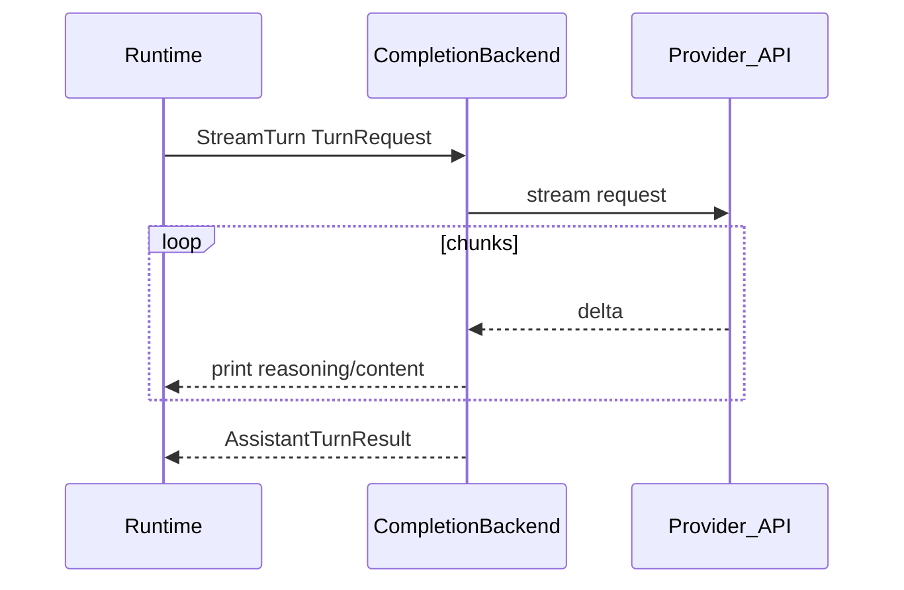

# LLM layer

## Purpose

Translate `chatstore` messages into provider API requests, stream assistant output to the terminal, collect usage, handle reasoning streams, and enforce stream integrity where applicable.

## Provider backends

| Protocol | Implementation | API surface |
|----------|----------------|-------------|
| `openai` (default) | `OpenAIBackend` | OpenAI Chat Completions (`openai-go`) |
| `anthropic` | `AnthropicBackend` | Anthropic Messages API (HTTP + SSE) |

Runtime holds `CompletionBackend` (`NewCompletionBackend` in [`internal/llm/factory.go`](../../internal/llm/factory.go)). OpenAI-compatible and ChatGPT Sub providers use `openai`; Anthropic Compatible API providers use `anthropic`.

## Packages and files

| Package / file | Responsibility |
|----------------|----------------|
| `internal/llm/backend.go` | `CompletionBackend`, `TurnRequest`, `ToolDef` |
| `internal/llm/openai_backend.go` | OpenAI adapter |
| `internal/llm/anthropic_*.go` | Anthropic mapper, stream, usage |
| `internal/llm/stream.go` | Shared types, OpenAI stream helpers |
| `internal/llm/params.go` | `MessageParams`, images `[img-N]`, token display |
| `internal/llm/reasoning.go` | `MessagesForAPI` (reasoning only on last assistant) |

## Key functions

| Function | Behavior |
|----------|----------|
| `CompletionBackend.StreamTurn` | Stream assistant turn (content, tools, usage) |
| `MessageParams` | Map session messages to OpenAI chat params |
| `buildAnthropicMessages` | Map session messages to Anthropic message blocks |
| `MessagesForAPI` | Strip `ReasoningText` from all but the last assistant message |
| `AggregateConsecutiveTurnUsage` | Footer stats across tool sub-turns |
| `ErrStreamAccumulatorRejected` | OpenAI stream chunk rejected — turn aborted |

## Reasoning and thinking

- **Display:** `ReasoningText` in session; `show_thinking` / `reasoning_effort` (OpenAI path).
- **API history:** only the **last** assistant message may include reasoning toward the model (`MessagesForAPI`).
- **Anthropic extended thinking:** disabled in v1 (no `thinking` blocks in requests).
- **Compaction:** `/summarize` transcript and retained tail omit reasoning text.

## Usage stats

`UsageStats` is provider-agnostic. Anthropic maps `input_tokens`, `output_tokens`, `cache_read_input_tokens`, and `cache_creation_input_tokens` (creation stored but not shown in the REPL footer v1).

## Images

User messages may contain `[img-N]` placeholders. OpenAI uses `image_url` data URIs; Anthropic uses `image` blocks with base64 `source` (PNG/JPEG/GIF).

## Stream integrity (OpenAI)

`ChatCompletionAccumulator.AddChunk` must accept every chunk in a single completion stream. On rejection, Solomon aborts the turn without persisting partial results.

Tests: [`test/stream_integrity_test.go`](../../test/stream_integrity_test.go).

## Flow

## See also

- [Agent turn pipeline](agent-turn-pipeline.md)
- [Sessions and storage](sessions-and-storage.md)
- [Configuration](../user-guide/configuration.md)
