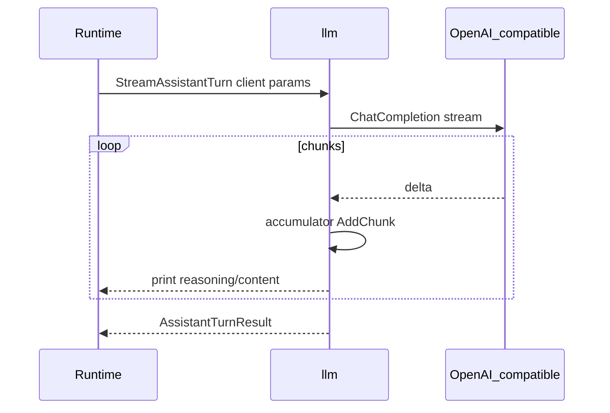

# LLM layer

## Purpose

Translate `chatstore` messages into OpenAI chat completion params, stream assistant output to the terminal, collect usage, handle reasoning streams, and enforce stream accumulator integrity (fail-closed).

## Packages and files

| Package / file | Responsibility |
|----------------|----------------|
| `internal/llm/stream.go` | `StreamAssistantTurn`, streaming display, accumulator |
| `internal/llm/params.go` | `MessageParams`, images `[img-N]`, token display helpers |
| `internal/agent/tools/openai.go` | Shared OpenAI types at tool boundary |

## Key functions

| Function | Behavior |
|----------|----------|
| `StreamAssistantTurn` | Stream chunks, build assistant message, tool calls, usage stats |
| `MessageParams` | Map session messages + image files to API params |
| `ImagePlaceholder` | `[img-N]` tag format for pasted images |
| `JumpLeftOverImgTag` / `JumpRightOverImgTag` | REPL cursor skips image tags |
| `AggregateConsecutiveTurnUsage` | Footer stats across turns in one user message |
| `ErrStreamAccumulatorRejected` | Chunk rejected (e.g. inconsistent completion id) — turn aborted, not persisted |

## Stream integrity

`ChatCompletionAccumulator.AddChunk` must accept every chunk in a single completion stream. On rejection, Solomon aborts the turn without salvaging reasoning, content, or usage into the session. Terminal output already printed may remain visible.

Tests: [`test/stream_integrity_test.go`](../../test/stream_integrity_test.go).

## Reasoning and thinking

Config `reasoning_effort` and `show_thinking` interact with stream rendering. `systemPrompt(disableThinking)` passes `DisableThinking` when effort is `none`.

Bracketed reasoning in stored content is split for display via `chatstore.AssistantDisplayParts`.

## Images

User messages may contain `[img-N]` placeholders; `Session.ImageFiles` maps index to on-disk paths under the project chat images directory. Params layer attaches image parts for the API.

## Flow

## Extension points

- Provider quirks: adjust `params.go` mapping or stream handler in `stream.go`.
- New display helpers: `termcolor` usage from stream package.

## Related code

- [`internal/llm/stream.go`](../../internal/llm/stream.go)
- [`internal/llm/params.go`](../../internal/llm/params.go)

## See also

- [Agent turn pipeline](agent-turn-pipeline.md)
- [Sessions and storage](sessions-and-storage.md)
- [Configuration](../user-guide/configuration.md)
