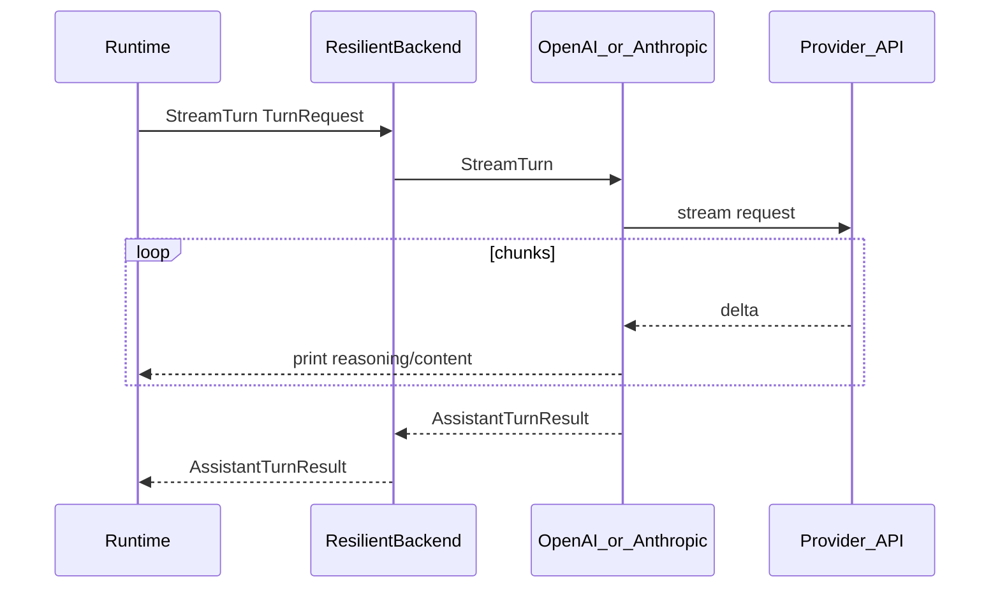

# LLM layer

## Purpose

Translate `chatstore` messages into provider API requests, stream assistant output to the terminal, collect usage, handle reasoning streams, and enforce stream integrity where applicable.

## Provider backends

| Protocol | Implementation | API surface |
|----------|----------------|-------------|
| `openai` (default) | `OpenAIBackend` | OpenAI Chat Completions (`openai-go`) |
| `anthropic` | `AnthropicBackend` | Anthropic Messages API (HTTP + SSE) |

Runtime holds `CompletionBackend` (`NewCompletionBackend` in [`internal/llm/factory.go`](../../internal/llm/factory.go)). OpenAI-compatible and ChatGPT Sub providers use `openai`; Anthropic Compatible API providers use `anthropic`.

## Model discovery

Model selection uses live provider catalogs. OpenAI-compatible providers use the standard models endpoint; Anthropic providers use the Anthropic models endpoint; ChatGPT Sub uses the Codex subscription models endpoint; Claude Sub uses its authenticated Anthropic endpoint; Cursor Sub queries the Cursor subscription catalog; and Cursor API uses the sidecar catalog. The `/models` command caches the catalogs during startup, refreshes a provider when it is selected, and keeps successful provider results available when another provider cannot be reached.

Provider-specific filtering and ordering are applied before the ids reach the picker. Role validation uses the same provider listing path, so configured `[[roles.subagent]]` models must still be present in the provider’s current catalog.

## ChatGPT Sub (Codex OAuth)

Subscription providers use the OpenAI backend with Codex-oriented middleware instead of a static API key.

| Area | Path | Role |
|------|------|------|
| OAuth / PKCE | `internal/auth/openai/codex/oauth.go`, `pkce.go` | Browser login, token exchange, refresh |
| JWT / account | `internal/auth/openai/codex/jwt.go` | Parse account id from id_token |
| HTTP middleware | `internal/auth/openai/codex/chatgpt_middleware.go` | Attach bearer token, Codex headers |
| SSE transform | `internal/auth/openai/codex/chat/sse_*.go` | Stream shaping for subscription endpoint |
| Setup UX | `internal/providersetup/`, `commands/connect/` | `/connect` wizard and provider blocks in TOML |

Tokens are stored in `config.toml` today (secure vault is planned — see [TODO.md](../../TODO.md)). Tests: [`test/provider_auth_test.go`](../../test/provider_auth_test.go), [`test/codex_upstream_error_test.go`](../../test/codex_upstream_error_test.go).

## Cursor Sub direct Agent connection

Cursor Sub uses a dedicated backend and talks to the subscription Agent service directly. It does not start or inspect Cursor CLI, Cursor desktop, or the Cursor API sidecar. Browser sign-in and token refresh live under `internal/auth/cursor/`; model listing and the streaming Agent transport use the same account session.

The backend maps Solomon turns, model parameters, images, tool schemas, prior assistant tool calls, and tool results into Cursor Agent requests. Agent events are mapped back to streamed content and reasoning, native tool calls, and usage. Solomon's regular turn loop executes each returned tool and submits its result in the next request. Requests containing tools are not automatically replayed after transport failure, avoiding duplicate side effects.

The transport resolves the Agent service URL through Cursor's server configuration endpoint and uses Connect over HTTP/2. The subscription API key is exchanged for a short-lived session token; refreshed credentials are persisted by the provider auth layer. A missing/expired login can be repaired with `/connect` → Cursor Sub.

| Area | Implementation |
|------|----------------|
| Browser login, refresh, model catalog, API key exchange | [`internal/auth/cursor/`](../../internal/auth/cursor/) |
| Agent Connect transport and compact wire decoder | [`agent.go`](../../internal/auth/cursor/agent.go), [`agent_wire.go`](../../internal/auth/cursor/agent_wire.go) |
| Solomon completion adapter | [`cursor_sub.go`](../../internal/llm/cursor_sub.go), [`factory.go`](../../internal/llm/factory.go) |
| Provider setup and token persistence | [`run.go`](../../internal/providersetup/run.go), [`provider_auth.go`](../../internal/config/provider_auth.go) |

The Agent endpoint uses Protocol Buffers, but Solomon handles only the request and event fields its integration needs. A previous generated Go binding contained Cursor's much broader service schema and expanded into roughly 62,000 lines in one file. The current decoder reads the needed wire fields directly, skips unknown fields, and retains only the upstream license and notice; this keeps the endpoint integration small while allowing unrelated protocol additions to pass through.

Some Cursor models persist their final assistant message as a KV blob without sending text deltas. When a turn ends without streamed content, Solomon extracts text parts from the latest persisted assistant message and excludes reasoning parts.

Deterministic request, stream, tool, image, and auth tests run with `go test ./...`. Optional account-backed tests are gated by `SOLOMON_CURSOR_DIRECT_LIVE=1`; they require a configured Cursor Sub account. Grok text, tool continuation, image input, and Composer tool continuation have live coverage in [`test/cursor_agent_direct_live_test.go`](../../test/cursor_agent_direct_live_test.go), [`test/cursor_agent_tool_live_test.go`](../../test/cursor_agent_tool_live_test.go), and [`test/cursor_agent_image_live_test.go`](../../test/cursor_agent_image_live_test.go).

## Packages and files

| Package / file | Responsibility |
|----------------|----------------|
| `internal/llm/types_alias.go` | Re-exports `CompletionBackend`, `TurnRequest`, `ToolDef` from `apitype` |
| `internal/llm/apitype/backend.go` | Shared LLM protocol types and `CompletionBackend` interface |
| `internal/llm/openai_backend.go` | OpenAI adapter |
| `internal/llm/anthropic_*.go` | Anthropic mapper, stream, usage |
| `internal/llm/stream/completion.go` | OpenAI completion streaming (`StreamText`, `StreamAssistantTurn`) |
| `internal/llm/stream/helpers.go` | Stream I/O helpers and chunk JSON parsers |
| `internal/llm/stream_api.go` | `llm` package facade over `stream` |
| `internal/llm/params.go` | `MessageParams`, images `[img-N]`, token display |
| `internal/llm/reasoning.go` | `MessagesForAPI` (reasoning only on last assistant) |
| `internal/llm/httpresilience.go` | Error classification, backoff, circuit breaker, HTTP client |
| `internal/llm/resilient_backend.go` | `ResilientBackend` decorator (retry full turn) |
| `internal/modelsapi/` | Provider model-list HTTP helpers and Anthropic model ordering |

Runtime wraps every `CompletionBackend` from `NewCompletionBackend` in `ResilientBackend`. OpenAI SDK retries are disabled (`WithMaxRetries(0)`); Solomon handles retries at turn level.

## API resilience

- **Retry:** Configurable attempts (default 3) for retryable HTTP codes (429, 5xx, 408) and transient network errors. Full stream turn is retried; the REPL prints an explicit line via `StreamOpts.OnRetry` before each wait.
- **Backoff:** Exponential delay from `base_delay_ms` to `max_delay_ms`, optional jitter, honors `Retry-After` when present.
- **Circuit breaker:** After all retries fail for a request, the provider host (`base_url` host) is opened for `circuit_open_sec` (default 60s). The next turn still probes the API (half-open); a successful turn clears the open state immediately. Failed probes while open keep the circuit tripped until expiry or success.
- **Timeouts:** `connect_timeout_sec` on dial and response headers; `read_timeout_sec` optional for non-stream calls (`CompleteText`, `ListModels`). Streams keep body read unlimited.
- **Not retried:** `ErrStreamAccumulatorRejected`, 401/403/404/422, and other permanent errors.

Tests: [`test/api_resilience_test.go`](../../test/api_resilience_test.go), [`test/resilient_backend_test.go`](../../test/resilient_backend_test.go), [`test/api_resilience_anthropic_test.go`](../../test/api_resilience_anthropic_test.go), [`test/api_resilience_openai_test.go`](../../test/api_resilience_openai_test.go).

## Key functions

| Function | Behavior |
|----------|----------|
| `CompletionBackend.StreamTurn` | Stream assistant turn (content, tools, usage) |
| `MessageParams` | Map session messages to OpenAI chat params |
| `buildAnthropicMessages` | Map session messages to Anthropic message blocks |
| `MessagesForAPI` | Strip `ReasoningText` from all but the last assistant message |
| `AggregateConsecutiveTurnUsage` | Footer stats across tool sub-turns |
| `ErrStreamAccumulatorRejected` | OpenAI stream chunk rejected — turn aborted |

## Reasoning and thinking

- **Display:** `ReasoningText` in session; `show_thinking` / `reasoning_effort` (OpenAI path).
- **API history:** only the **last** assistant message may include reasoning toward the model (`MessagesForAPI`).
- **Anthropic extended thinking:** disabled in v1 (no `thinking` blocks in requests).
- **Compaction:** `/summarize` transcript and retained tail omit reasoning text.

## Usage stats

`UsageStats` is provider-agnostic. Anthropic maps `input_tokens`, `output_tokens`, `cache_read_input_tokens`, and `cache_creation_input_tokens` (creation stored but not shown in the REPL footer v1).

## Images

User messages may contain `[img-N]` placeholders. OpenAI uses `image_url` data URIs; Anthropic uses `image` blocks with base64 `source` (PNG/JPEG/GIF).

## Stream integrity (OpenAI)

`ChatCompletionAccumulator.AddChunk` must accept every chunk in a single completion stream. On rejection, Solomon aborts the turn without persisting partial results.

Tests: [`test/stream_integrity_test.go`](../../test/stream_integrity_test.go).

## Legacy XML streaming

When `[tools].legacy` is enabled, runtime wraps the terminal `contentOut` writer with [`LegacyStreamWriter`](../../internal/tooling/legacy_stream.go). The writer passes through normal prose, buffers `<tool_calls>…</tool_calls>`, renders tool lines like native calls, and returns `ErrLegacyToolBlockComplete` at the closing tag so the stream loop stops before trailing text. OpenAI and Anthropic backends treat that error as a successful early stop; Anthropic ignores native `tool_use` blocks that arrive after a legacy stop.

Malformed blocks and unknown tool names surface as stream errors with model retry (see [Agent turn pipeline — Legacy XML](agent-turn-pipeline.md#legacy-xml-tool-calling)).

## Flow

```mermaid
sequenceDiagram
  participant RT as Runtime
  participant RB as ResilientBackend
  participant BE as OpenAI_or_Anthropic
  participant API as Provider_API

  RT->>RB: StreamTurn TurnRequest
  RB->>BE: StreamTurn
  BE->>API: stream request
  loop chunks
    API-->>BE: delta
    BE-->>RT: print reasoning/content
  end
  BE-->>RB: AssistantTurnResult
  RB-->>RT: AssistantTurnResult
```

## See also

- [Agent turn pipeline](agent-turn-pipeline.md)
- [Sessions and storage](sessions-and-storage.md)
- [Configuration](../user-guide/configuration.md)
- [Supporting packages — ChatGPT Sub auth](supporting-packages.md#chatgpt-sub-auth)
