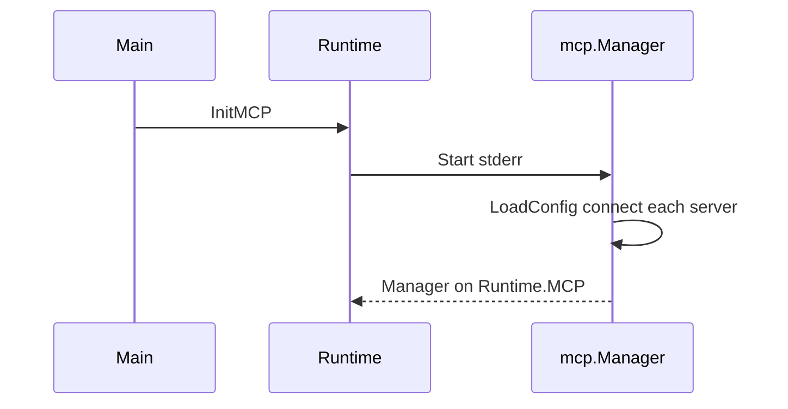

# MCP integration

## Purpose

Load optional MCP servers from JSON, connect via stdio or streamable HTTP, register remote tools for the model, and execute calls through the OpenAI tool path.

## Packages and files

| File | Role |
|------|------|
| `internal/mcp/config.go` | Load `mcp.json`, env expansion |
| `internal/mcp/manager.go` | Connect servers, registry, `CallTool`, `OpenAITools` |
| `internal/mcp/transport.go` | stdio vs streamable-http |
| `internal/mcp/adapter.go` | MCP tool → OpenAI function schema |
| `internal/agent/runtime/mcp.go` | `InitMCP`, append MCP tools to params |

## Configuration file

Default path: `~/.solomon/mcp.json`. Override: `SOLOMON_MCP_CONFIG`.

Example:

```json
{
  "mcpServers": {
    "filesystem": {
      "type": "stdio",
      "command": "npx",
      "args": ["-y", "@modelcontextprotocol/server-filesystem", "$WORKSPACE"],
      "cwd": "$WORKSPACE",
      "env": { "TOKEN": "$MCP_TOKEN" },
      "allow": ["read_file"],
      "deny": ["write_file"],
      "timeout": 120000
    },
    "remote": {
      "type": "streamable-http",
      "url": "https://example.com/mcp",
      "headers": { "Authorization": "Bearer $MCP_TOKEN" }
    }
  }
}
```

Rules:

- Server names sorted and stable before connect.
- `type` defaults to `stdio`; if `url` is set, default is `streamable-http`.
- `$ENV_NAME` expanded in command, args, cwd, env, URL, headers; missing vars disable MCP with a warning.
- `timeout` in milliseconds.
- `allow` / `deny` filter by original MCP tool name.
- Exposed to the model as `MCP<server>-<tool>`.

User-oriented summary: [Configuration](../user-guide/configuration.md).

## Key functions

| Function | Behavior |
|----------|----------|
| `mcp.Start` | `LoadConfig` + `NewManager` |
| `Manager.connectServer` | SDK client connect per server config |
| `Manager.registerTools` | Apply allow/deny, build registry |
| `Manager.OpenAITools` | Schemas appended in `Runtime.toolParams` |
| `Manager.CallTool` | Invoked from `tools.dispatchExternal` |
| `Manager.ToolDump` | Appended to system prompt tool section |
| `Manager.Close` | Shutdown sessions on REPL exit |

## Startup flow



## Extension points

- New transport: extend `transport.go`.
- Tool naming: adapter package.

## Related code

- [`internal/mcp/manager.go`](../../internal/mcp/manager.go)
- [`internal/agent/runtime/mcp.go`](../../internal/agent/runtime/mcp.go)

## See also

- [Native tools](native-tools.md)
- [Agent turn pipeline](agent-turn-pipeline.md)
- [Configuration](../user-guide/configuration.md)
