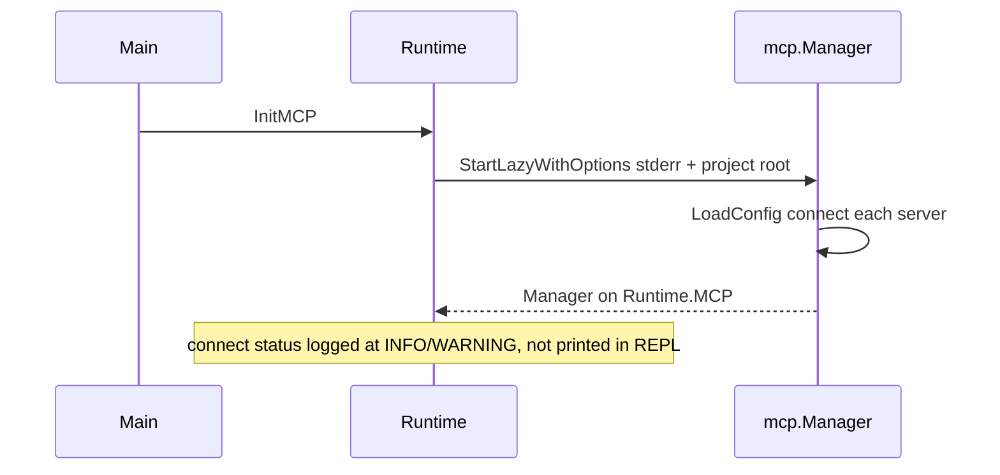

# MCP integration

## Purpose

Load optional MCP servers from JSON, connect via stdio, legacy SSE, or streamable HTTP, and act as a complete MCP host/client for the core protocol surface. Tools are projected into model-native calls; resources, resource templates, prompts, completions, subscriptions, roots, multi-round-trip input requests, callbacks, and OAuth remain available through the manager API.

The official Go SDK is pinned at `v1.7.0`, which supports MCP `2026-07-28` through the stateless `server/discover` flow and falls back to the legacy `2025-11-25` initialization flow for older servers.

## Packages and files

| File | Role |
|------|------|
| `internal/mcp/config.go` | Load `mcp.json`, env expansion |
| `internal/mcp/manager.go` | Connect servers, registry, tool calls, lifecycle |
| `internal/mcp/transport.go` | stdio, legacy SSE, and streamable-http |
| `internal/mcp/adapter.go` | MCP tool → OpenAI function schema |
| `internal/mcp/features.go` | Resources, prompts, completions, subscriptions, roots and negotiated server state |
| `internal/mcp/options.go` | Host callbacks, roots and injectable OAuth handlers |
| `internal/agent/runtime/mcp.go` | `InitMCP`, append MCP tools to params |

## Configuration file

Default path: `~/.solomon/mcp.json`. Override: `SOLOMON_MCP_CONFIG`.

Example:

```json
{
  "mcpServers": {
    "filesystem": {
      "type": "stdio",
      "command": "npx",
      "args": ["-y", "@modelcontextprotocol/server-filesystem", "$WORKSPACE"],
      "cwd": "$WORKSPACE",
      "env": { "TOKEN": "$MCP_TOKEN" },
      "allow": ["read_file"],
      "deny": ["write_file"],
      "timeout": 120000
    },
    "remote": {
      "type": "streamable-http",
      "url": "https://example.com/mcp",
      "headers": { "Authorization": "Bearer $MCP_TOKEN" },
      "oauth": {
        "clientId": "$MCP_CLIENT_ID",
        "redirectUrl": "http://127.0.0.1:8787/oauth/callback",
        "requestRefreshToken": true
      }
    }
  }
}
```

Rules:

- Server names sorted and stable before connect.
- `type` defaults to `stdio`; if `url` is set, default is `streamable-http`.
- Supported HTTP types are `streamable-http` for the current transport and `sse` for legacy 2024-11-05 servers.
- `$ENV_NAME` expanded in command, args, cwd, env, URL, headers and OAuth fields; missing vars disable MCP with a warning.
- `timeout` in milliseconds.
- Exposed to the model as `MCP.<server>.<tool>` (sanitized and made unique when necessary).
- `allow` / `deny` filter tools by their original MCP name; resources and prompts are catalogued independently.
- OAuth client registration is configured in `mcp.json`, while interactive authorization and token persistence are supplied by `ManagerOptions` or a custom `OAuthHandler`. No credential is embedded in Solomon's build.
- With an HTTP server that supports MCP `2026-07-28`, the SDK uses `server/discover` and `subscriptions/listen`; older servers fall back to legacy initialization and resource subscription calls.

User-oriented summary: [Configuration](../user-guide/configuration.md).

## Key functions

| Function | Behavior |
|----------|----------|
| `mcp.Start` / `StartWithOptions` | Load config and lazily/eagerly connect servers |
| `Manager.connectServer` | Negotiate MCP version and register every advertised core catalog |
| `Manager.Tools` / `Catalog` | Expose complete descriptors and searchable tool projections |
| `Manager.OpenAITools` | Project allowed MCP tools into native model tool schemas |
| `Manager.CallTool` | Invoke a connected tool; SDK automatically fulfills July multi-round-trip requests when host handlers are configured |
| `Manager.ListResources` / `ReadResource` | Enumerate and read host-managed resources and templates |
| `Manager.ListPrompts` / `GetPrompt` / `Complete` | Enumerate, render and complete prompt arguments |
| `Manager.Subscribe` / `Unsubscribe` | Use July `subscriptions/listen` or legacy resource subscriptions |
| `Manager.Ping` / `SetLoggingLevel` | Use legacy compatibility RPCs; July removes both in favor of the modern session model |
| `Manager.AddRoots` / `RemoveRoots` | Update the roots available to connected servers |
| `Manager.Close` | Shutdown sessions on REPL exit |

## Startup flow


```mermaid
sequenceDiagram
  participant Main
  participant RT as Runtime
  participant MCP as mcp.Manager

  Main->>RT: InitMCP
  RT->>MCP: StartLazyWithOptions stderr + project root
  MCP->>MCP: LoadConfig connect each server
  MCP-->>RT: Manager on Runtime.MCP
  Note over RT: connect status logged at INFO/WARNING, not printed in REPL
```

## Host callbacks and lifecycle

`ManagerOptions.ClientOptions` is passed to each SDK client. It supports elicitation, sampling, progress, logging, list-change notifications, resource updates, explicit capabilities, and multi-round-trip configuration. The manager wraps list-change handlers to keep its catalogs synchronized before forwarding notifications to the host.

Roots are configured per manager and Solomon's runtime supplies the current project root. Sampling, roots, and logging are deprecated by the July protocol but remain wired for compatibility; new integrations should prefer tool parameters, resource URIs, or direct provider calls where applicable.

## Extension points

- New transport: extend `transport.go`.
- Tool naming: adapter package.
- Interactive auth/token persistence: `ManagerOptions.OAuthHandler` or `AuthorizationCodeFetcher`.
- Host UI/LLM integration: `ManagerOptions.ClientOptions` handlers.

## Related code

- [`internal/mcp/manager.go`](../../internal/mcp/manager.go)
- [`internal/agent/runtime/mcp.go`](../../internal/agent/runtime/mcp.go)

## See also

- [Native tools](native-tools.md)
- [Agent turn pipeline](agent-turn-pipeline.md)
- [Configuration](../user-guide/configuration.md)
