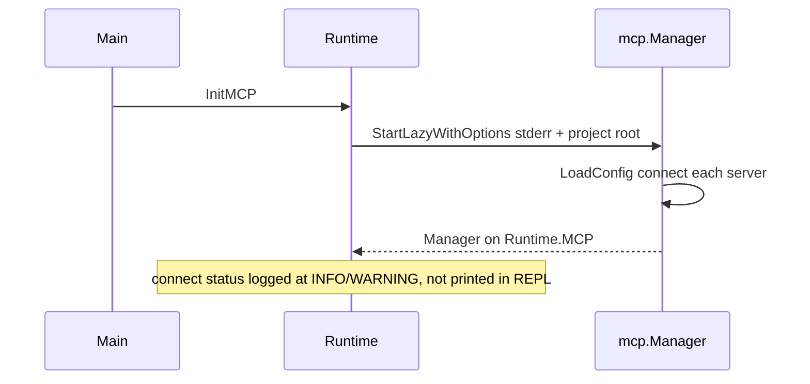

# MCP integration

## Purpose

Load optional MCP servers from JSON, connect via stdio, legacy SSE, or streamable HTTP, and act as a complete MCP host/client for the core protocol surface. MCP tools are catalogued as deferred tools and invoked through Code Mode's `orchestrate` path; they are not projected into the model's native tool list. Resources, resource templates, prompts, completions, subscriptions, roots, multi-round-trip input requests, callbacks, and OAuth remain available through the manager API.

The official Go SDK is pinned at `v1.7.0`, which supports MCP `2026-07-28` through the stateless `server/discover` flow and falls back to the legacy `2025-11-25` initialization flow for older servers.

## Packages and files

| File | Role |
|------|------|
| `internal/mcp/config.go` | Load `mcp.json`, env expansion |
| `internal/mcp/manager.go` | Connect servers, registry, tool calls, lifecycle |
| `internal/mcp/session.go` | Ephemeral session replacement, recovery state and subscription bookkeeping |
| `internal/mcp/transport.go` | stdio, legacy SSE, and streamable-http |
| `internal/mcp/adapter.go` | MCP tool → OpenAI function schema |
| `internal/mcp/features.go` | Resources, prompts, completions, subscriptions, roots and negotiated server state |
| `internal/mcp/options.go` | Host callbacks, roots and injectable OAuth handlers |
| `internal/agent/runtime/mcp.go` | `InitMCP`, project-root roots, expose the catalog to `searchTools` and `orchestrate` |

## Configuration file

Default path: `~/.solomon/mcp.json`. Override: `SOLOMON_MCP_CONFIG`.

Example:

```json
{
  "mcpServers": {
    "filesystem": {
      "type": "stdio",
      "command": "npx",
      "args": ["-y", "@modelcontextprotocol/server-filesystem", "$WORKSPACE"],
      "cwd": "$WORKSPACE",
      "env": { "TOKEN": "$MCP_TOKEN" },
      "allow": ["read_file"],
      "deny": ["write_file"],
      "timeout": 120000
    },
    "remote": {
      "type": "streamable-http",
      "url": "https://example.com/mcp",
      "headers": { "Authorization": "Bearer $MCP_TOKEN" },
      "oauth": {
        "clientId": "$MCP_CLIENT_ID",
        "redirectUrl": "http://127.0.0.1:8787/oauth/callback",
        "requestRefreshToken": true
      }
    },
    "exa-web": {
      "type": "streamable-http",
      "url": "https://mcp.exa.ai/mcp",
      "internal": true,
      "adapter": "exa",
      "allow": ["web_search_exa", "web_fetch_exa"]
    },
    "parallel-web": {
      "type": "streamable-http",
      "url": "https://search.parallel.ai/mcp",
      "internal": true,
      "adapter": "parallel",
      "allow": ["web_search", "web_fetch"]
    }
  }
}
```

Rules:

- Server names sorted and stable before connect.
- `type` defaults to `stdio`; if `url` is set, default is `streamable-http`.
- Supported HTTP types are `streamable-http` for the current transport and `sse` for legacy 2024-11-05 servers.
- `$ENV_NAME` expanded in command, args, cwd, env, URL, headers and OAuth fields; missing vars disable MCP with a warning.
- `timeout` in milliseconds.
- Catalogued for Code Mode as `MCP.<server>.<tool>` (sanitized and made unique when necessary); the model invokes the entry through `sdk.mcp.<tool>(intent, args)`.
- `allow` / `deny` filter tools by their original MCP name; resources and prompts are catalogued independently.
- `internal: true` marks a server as host-managed. Its tools are hidden from the model-facing catalog and can only be invoked by a native adapter through the MCP manager. `adapter` selects Solomon's host adapter; the configured MCP adapters are `exa` and `parallel`.
- The `exa` and `parallel` entries above use public no-key MCP endpoints. CloakBrowser is not an MCP server: the standard installer places the official `cloakbrowser` npm package and `playwright-core` under `~/.solomon/cloakbrowser`, downloads the public browser with `npx --no-install cloakbrowser install`, and Solomon uses a small local Node/Playwright shim controlled by its Go adapter. No provider key is embedded or persisted by Solomon.
- A legacy `internal` server with `adapter: "cloak"` is ignored, so an old community bridge cannot be started accidentally after upgrading. The native Cloak fallback creates and closes an isolated browser tab per request.
- OAuth client registration is configured in `mcp.json`, while interactive authorization and token persistence are supplied by `ManagerOptions` or a custom `OAuthHandler`. No credential is embedded in Solomon's build.
- With an HTTP server that supports MCP `2026-07-28`, the SDK uses `server/discover` and `subscriptions/listen`; older servers fall back to legacy initialization and resource subscription calls.
- A connected session is treated as ephemeral. Its server configuration, roots, catalog policy and desired subscriptions are retained by Solomon, so a lost session can be negotiated again without changing the deferred tool names exposed to Code Mode.
- Non-tool MCP operations retry once after a detected session failure. Tool calls are conservative: a call rejected because the session is missing may be replayed, while a lost response is reported as an unknown outcome unless `ManagerOptions.RetryToolCall` explicitly authorizes replay.

User-oriented summary: [Configuration](../user-guide/configuration.md).

## Key functions

| Function | Behavior |
|----------|----------|
| `mcp.Start` / `StartWithOptions` | Load config and lazily/eagerly connect servers |
| `Manager.connectServer` | Negotiate MCP version and register every advertised core catalog |
| `Manager.Tools` / `Catalog` | Expose complete descriptors and searchable deferred-tool projections |
| `Manager.OpenAITools` | Compatibility projection for callers that still need an OpenAI schema; not exposed by the agent runtime |
| `Manager.CallTool` | Invoke a connected tool from the deferred `orchestrate` dispatcher; SDK automatically fulfills July multi-round-trip requests when host handlers are configured |
| `Manager.CallInternalTool` | Invoke an internal adapter tool by server/tool name while retaining the manager's session recovery, retry policy and logging; never exposes the call to the model catalog |
| `Manager.ListResources` / `ReadResource` | Enumerate and read host-managed resources and templates |
| `Manager.ListPrompts` / `GetPrompt` / `Complete` | Enumerate, render and complete prompt arguments |
| `Manager.Subscribe` / `Unsubscribe` | Use July `subscriptions/listen` or legacy resource subscriptions |
| `Manager.Ping` / `SetLoggingLevel` | Use legacy compatibility RPCs; July removes both in favor of the modern session model |
| `Manager.AddRoots` / `RemoveRoots` | Update the roots available to connected servers |
| `Manager.Close` | Shutdown sessions on REPL exit |

## Native CloakBrowser fallback

CloakBrowser is a special local backend, not a generic MCP server. Go owns the
adapter, tab lifecycle, DOM parsing, link normalization, result shaping and
Markdown conversion. The only Node code is the unavoidable Playwright binding
that loads the official `cloakbrowser` package and exposes a private
JSON-lines process boundary.

The public install path requires Node.js 20+, `cloakbrowser`, and
`playwright-core`; the installer downloads the official browser into the
Solomon-managed cache. Runtime auto-update is disabled so the installed binary
does not change behind Solomon's back.

## Startup flow


```mermaid
sequenceDiagram
  participant Main
  participant RT as Runtime
  participant MCP as mcp.Manager

  Main->>RT: InitMCP
  RT->>MCP: StartLazyWithOptions stderr + project root
  MCP->>MCP: LoadConfig connect each server
  MCP-->>RT: Manager on Runtime.MCP
  Note over RT: connect status logged at INFO/WARNING, not printed in REPL
```

## Host callbacks and lifecycle

`ManagerOptions.ClientOptions` is passed to each SDK client. It supports elicitation, sampling, progress, logging, list-change notifications, resource updates, explicit capabilities, and multi-round-trip configuration. The manager wraps list-change handlers to keep its catalogs synchronized before forwarding notifications to the host.

When a session disappears, the manager reconnects under the same server binding, rehydrates the catalog and restores desired subscriptions. OAuth handlers are cached per configured server for the manager lifetime, allowing their token source and refresh state to survive session replacement; cross-process token persistence remains the host's responsibility. `DisableCatalogSubscriptions` can be used by request/response adapters that do not need the modern catalog notification stream. `Close` cancels recovery and subscription goroutines and is idempotent.

Roots are configured per manager and Solomon's runtime supplies the current project root. Sampling, roots, and logging are deprecated by the July protocol but remain wired for compatibility; new integrations should prefer tool parameters, resource URIs, or direct provider calls where applicable.

## Extension points

- New transport: extend `transport.go`.
- Tool naming: adapter package.
- Interactive auth/token persistence: `ManagerOptions.OAuthHandler` or `AuthorizationCodeFetcher`.
- Host UI/LLM integration: `ManagerOptions.ClientOptions` handlers.

## Related code

- [`internal/mcp/manager.go`](../../internal/mcp/manager.go)
- [`internal/agent/runtime/mcp.go`](../../internal/agent/runtime/mcp.go)

## See also

- [Native tools](native-tools.md)
- [Agent turn pipeline](agent-turn-pipeline.md)
- [Configuration](../user-guide/configuration.md)
