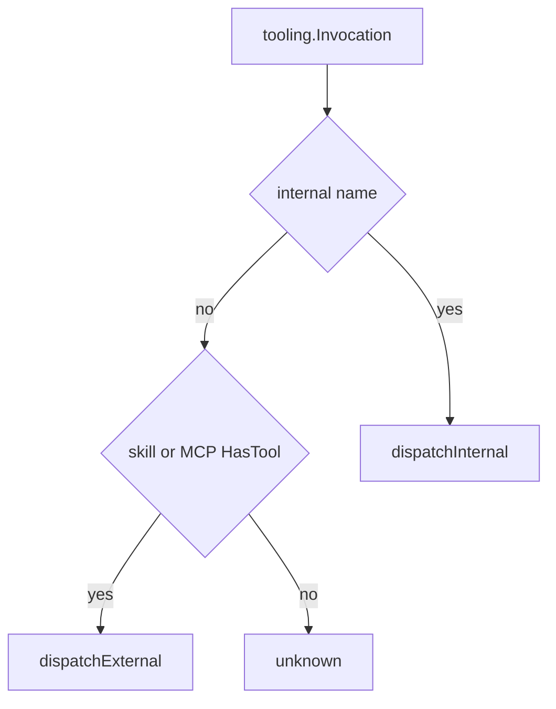

# Native tools

## Purpose

Built-in OpenAI function tools implemented in Go (plan and build sets), plus routing to skills and MCP. Invocations are parsed via `internal/tooling` and executed through `tools.Exec`.

## Packages and files

| File area | Tools / role |
|-----------|----------------|
| `create_plan.go`, `edit_plan.go`, `build_plan.go` | Plan mode |
| `shell.go`, `read_file.go`, `edit_file.go`, `find.go`, `filewalk.go`, `search_pool.go` | Build mode filesystem/shell/search |
| `internal/pathglob`, `internal/gitignore` | Glob `**` matching and `.gitignore` (vendored matcher) |
| `subagent.go` | Nested agent run |
| `list_sub_agents.go` | Subagent role pool listing |
| `load_skill.go`, `search_skill.go` | Skill tools |
| `fetch_web.go`, `web_search.go` | Web fetch and search |
| `docs_retrieval.go` | Embedded docs BM25 search (`docsRetrieval`) |
| `exec.go` | `Exec`, `resolveToolInvocation`, dispatch |
| `env.go` | Type alias to [`internal/agent/toolenv/Env`](../../internal/agent/toolenv/env.go) |
| `internal/agent/toolenv/` | Canonical `Env` definition (avoids import cycles) |
| `dump_*.go` | Text descriptions for system prompt |
| `internal/tooling/parse.go`, `reflect.go` | Invocation parse and reflection |

## Key functions

| Function | Behavior |
|----------|----------|
| `tools.Exec` | Entry from runtime `execTool` |
| `resolveToolInvocation` | Internal vs skill vs MCP by name |
| `dispatchInternal` | Mode-checked native handlers |
| `dispatchExternal` | `loadSkill` / `searchSkill` or `MCP.CallTool` |
| `isInternalToolName` | Fixed set of native names |

## Internal tool names

| Name | Mode |
|------|------|
| `createPlan`, `editPlan`, `buildPlan`, todos | agent when `PlanningActive` (or deferred via orchestrate) |
| `subagent` | agent (native tool_call only; not deferred / orchestrate); optional `roleProvider` + `roleModel` from `[[roles.subagent]]` |
| `listSubAgents` | agent (lists configured subagent role pool) |
| `shell`, `readFile`, `editFile`, `find`, `fetchWeb`, `webSearch`, skills | deferred (orchestrate / legacy XML) |
| `searchTools`, `orchestrate`, `switchMode` | agent |
| `fetchWeb`, `webSearch`, `switchMode` | chat |

Skill tools: `loadSkill`, `searchSkill`. MCP tools use registered OpenAI names (`MCP<server>-<tool>`).

## Subagent roles

When `[[roles.subagent]]` is configured in `config.toml`, the primary agent can delegate nested runs to cheaper models:

| Step | Tool / args |
|------|-------------|
| Discover pool | `listSubAgents` — returns `provider`, `model`, `description`, `points` (sorted by points descending) |
| Spawn nested run | `subagent` with optional `roleProvider` + `roleModel` matching a pool row |
| Fallback | Omit both role fields → nested run uses the session provider and model |

Role rows are validated on **config load and save**: provider must exist in `[providers]`, the provider API must be reachable, and the model id must appear in that provider’s model list (`ListModelsForProviderAll`, same path as `/models`). Runtime `subagent` calls also require `roleProvider` + `roleModel` to match a configured pool row (`listSubAgents`). Invalid pairs are rejected with a hint to call `listSubAgents`. Resume and deferred nested spawns restore `role_provider` / `role_model` from the subsession or pending spawn payload when omitted.

Config schema: [`config.Roles`](../../internal/config/roles.go). Registry: [`internal/roles/registry.go`](../../internal/roles/registry.go).

## `editFile` semantics (build)

| Args | Behavior |
|------|----------|
| `oldString` non-empty, `newString` any | Replace **one** occurrence of `oldString` with `newString` |
| `oldString` empty, `newString` non-empty, `delete` false/absent | Create or overwrite file at `path` |
| `delete: true` | Remove file at `path` (`oldString` / `newString` ignored) |
| `renameTo` non-empty | Move/rename `path` to `renameTo`; `oldString`, `newString` empty; `delete` false; destination must not exist |
| `oldString` and `newString` both empty, `delete` false/absent, `renameTo` empty | Rejected (`editFile refuses empty overwrite`) |

All variants require non-empty `intent`. Paths are relative to the project root. With the Cursor sidecar, `Delete` maps to `editFile` with `delete: true` — see [Cursor integration](cursor-integration.md).

`editFile` mutations are recorded for checkpoint file staging; `/goto` restores the workspace for staged paths (byte snapshots under the session `staging/` directory).

## `find` semantics (build)

| Args | Behavior |
|------|----------|
| `files=true`, `pattern` | Glob listing of matching paths under `path` (default `.`), sorted by mtime descending; respects `.gitignore` |
| `files=false`, `pattern` | Go regexp content search; optional `pathGlob`, `outputMode` (`content`, `files_with_matches`, `count`), context lines, `headLimit`, `caseInsensitive`, `multiline` |
| `timeoutSeconds` | Optional per-call timeout (default 60s) |

Cursor `Grep`, `Glob`, and `SemanticSearch` map to `find` via the sidecar bridge ([Cursor integration](cursor-integration.md#tool-name-bridge)); semantic queries today use regexp fallback.

## Router flow

Legacy XML invocations (when `[tools].legacy` is enabled) are parsed by [`internal/tooling/legacy_xml.go`](../../internal/tooling/legacy_xml.go) and [`legacy_stream.go`](../../internal/tooling/legacy_stream.go); tool names are validated against the active native + MCP tool set before execution.

| Config | Request carries API tool schemas | Parser accepts |
|--------|----------------------------------|----------------|
| default | yes | native `tool_calls` |
| `legacy` | yes | native or `<tool_calls>` XML |
| `legacy_force` | no | `<tool_calls>` XML only |

## `toolenv`

Passed into every native tool via [`tools.Exec`](../../internal/agent/tools/exec.go). The struct is defined in [`internal/agent/toolenv/env.go`](../../internal/agent/toolenv/env.go) and re-exported as `tools.Env` in [`tools/env.go`](../../internal/agent/tools/env.go). Runtime builds it in [`Runtime.toolEnv()`](../../internal/agent/runtime/exec.go).

| Field | Purpose |
|-------|---------|
| `ProjHex`, `ProjRoot` | Workspace identity and root for relative paths |
| `Cfg` | Loaded TOML (web search, tool output limits) |
| `MCP` | MCP manager for external tool calls |
| `RunNested`, `RunNestedWithSystem` | `subagent` nested turn |
| `SetMode`, `CurrentMode` | Plan vs build mode switches |
| `Checkpoint*` callbacks | File staging for `/goto` after `editFile` |
| `ActivateInstructions*`, `MergeInstructionBlock` | `AGENTS.md` activation from `readFile` / `shell` |

To add a new callback: extend `toolenv.Env`, wire it in `runtime/exec.go`, use it from the tool handler. See [Package index — toolenv](package-index.md#toolenv--tool-execution-context).

## Extension points

1. Add `*OpenAI()` schema builder and exec handler.
2. Register name in `isInternalToolName` and `dispatchInternal`.
3. Add to `NativeToolParams` for the correct mode.
4. Update plan or build tool dump.

## Related code

- [`internal/agent/tools/exec.go`](../../internal/agent/tools/exec.go)
- [`internal/agent/runtime/exec.go`](../../internal/agent/runtime/exec.go)

## See also

- [Plan vs build](plan-vs-build.md) — agent/chat modes and deferred tools
- [Agent turn pipeline](agent-turn-pipeline.md)
- [MCP integration](mcp-integration.md)
- [Cursor integration](cursor-integration.md)
- [Skills and slash](skills-and-slash.md)
- [Configuration — `[tools]`](../user-guide/configuration.md#tools-legacy-xml-tool-calling)
