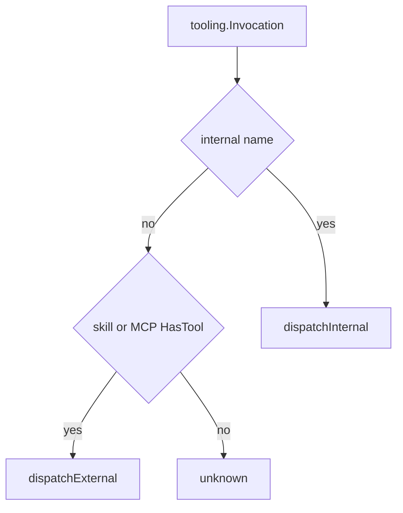

# Native tools

## Purpose

Built-in OpenAI function tools implemented in Go (plan and build sets), plus routing to skills and MCP. Invocations are parsed via `internal/tooling` and executed through `tools.Exec`.

## Packages and files

| File area | Tools / role |
|-----------|----------------|
| `create_plan.go`, `edit_plan.go`, `build_plan.go` | Plan mode |
| `shell.go`, `read_file.go`, `edit_file.go` | Build mode filesystem/shell |
| `subagent.go` | Nested agent run |
| `load_skill.go`, `search_skill.go` | Skill tools |
| `fetch_web.go`, `web_search.go` | Web fetch and search |
| `exec.go` | `Exec`, `resolveToolInvocation`, dispatch |
| `env.go` | `Env` — project root, MCP manager, config, callbacks |
| `dump_*.go` | Text descriptions for system prompt |
| `internal/tooling/parse.go`, `reflect.go` | Invocation parse and reflection |

## Key functions

| Function | Behavior |
|----------|----------|
| `tools.Exec` | Entry from runtime `execTool` |
| `resolveToolInvocation` | Internal vs skill vs MCP by name |
| `dispatchInternal` | Mode-checked native handlers |
| `dispatchExternal` | `loadSkill` / `searchSkill` or `MCP.CallTool` |
| `isInternalToolName` | Fixed set of native names |

## Internal tool names

| Name | Mode |
|------|------|
| `createPlan`, `editPlan`, `buildPlan` | plan |
| `shell`, `readFile`, `editFile`, `subagent`, `fetchWeb`, `webSearch` | build |

Skill tools: `loadSkill`, `searchSkill`. MCP tools use registered OpenAI names (`MCP<server>-<tool>`).

## Router flow

## `Env` struct

Passed into every tool: project hex/root, session reference, MCP manager, mode, stdout, config fragments for web search merge, nested run hook, etc. See [`env.go`](../../internal/agent/tools/env.go).

## Extension points

1. Add `*OpenAI()` schema builder and exec handler.
2. Register name in `isInternalToolName` and `dispatchInternal`.
3. Add to `NativeToolParams` for the correct mode.
4. Update plan or build tool dump.

## Related code

- [`internal/agent/tools/exec.go`](../../internal/agent/tools/exec.go)
- [`internal/agent/runtime/exec.go`](../../internal/agent/runtime/exec.go)

## See also

- [Plan vs build](plan-vs-build.md)
- [MCP integration](mcp-integration.md)
- [Skills and slash](skills-and-slash.md)
