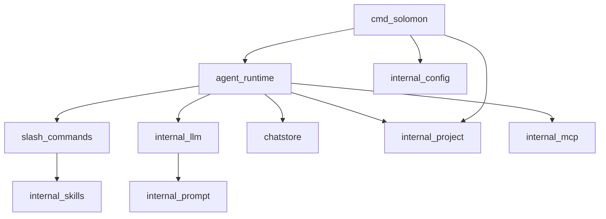

# Overview

## Purpose

Solomon is a terminal harness for OpenAI-compatible LLM APIs: project-scoped sessions, plan/build tool modes, skills, slash commands, optional MCP tools, and on-disk transcripts under `~/.solomon`.

## Design tenets

- **Local-first** — config, chats, plans, skills, and logs live under `~/.solomon`, keyed by canonical workspace root.
- **Bring-your-own API** — one binary; you choose `base_url`, API key, and model via TOML or `/connect`.
- **Explicit surfaces** — CLI modes (`exec`, `temp exec`, `add`/`remove`), REPL slash commands, separate plan vs build tooling, optional legacy XML tool calling for text-only backends.
- **Composable skills** — registry at global, project, and workspace scope; bound to slash or invoked as tools.
- **Optional observability** — reasoning streams, usage footers, structured file logs.

Compared to IDE-hosted or vendor-locked CLIs, Solomon keeps backend and workspace attachment under your control.

## Top-level layout

| Path | Role |
|------|------|
| `cmd/solomon/` | Single binary entry |
| `internal/agent/runtime/` | REPL, turns, persistence, MCP on runtime |
| `internal/agent/commands/` | Slash command implementations |
| `internal/agent/tools/` | Native OpenAI tools (plan/build) |
| `internal/agent/slash.go` | Slash parsing and dispatch |
| `internal/llm/` | Streaming, message params, usage |
| `internal/prompt/` | System prompt templates |
| `internal/chatstore/` | Session JSON I/O |
| `internal/mcp/` | MCP client manager and adapter |
| `internal/config/`, `internal/paths/`, `internal/project/` | Config and layout |
| `internal/skills/` | Skill registry and install |
| `internal/checkpoint/` | Checkpoint sequences and labels |
| `internal/tooling/` | Legacy `<tool_calls>` XML parse/stream; shared invocation types |
| `internal/search/` | Web search backends for `webSearch` |

## Package dependency graph

**Shape:** [`cmd/solomon/main.go`](../../cmd/solomon/main.go) loads config, resolves the project, builds `agentruntime.Runtime`, calls `InitMCP`, then `Run` (REPL) or `RunPromptOnce`. Runtime owns readline, slash bridge, chat turns, and session writes.

## Extension points

| Area | Hook |
|------|------|
| Slash commands | Register in [`commands/builtin_slash.go`](../../internal/agent/commands/builtin_slash.go) |
| Native tools | Add in `internal/agent/tools/` and wire in `params.go` / `exec.go` |
| MCP tools | Configure `mcp.json`; adapter exposes `MCP<server>-<tool>` names |
| Skills | `solomon add`, registry in `internal/skills/` |
| System prompts | Templates in `internal/prompt/templates/` via `RenderPlan` / `RenderBuild`; legacy syntax from `[tools]` config |
| Legacy tool calling | `[tools].legacy` / `legacy_force` in config or `/legacytools`; see [Agent turn pipeline](agent-turn-pipeline.md#legacy-xml-tool-calling) |

## Related code

- [`cmd/solomon/main.go`](../../cmd/solomon/main.go)
- [`internal/agent/runtime/core.go`](../../internal/agent/runtime/core.go)

## See also

- [Startup and CLI](startup-and-cli.md)
- [Agent turn pipeline](agent-turn-pipeline.md)
- [Native tools](native-tools.md)
- [Data layout](../user-guide/data-layout.md)
