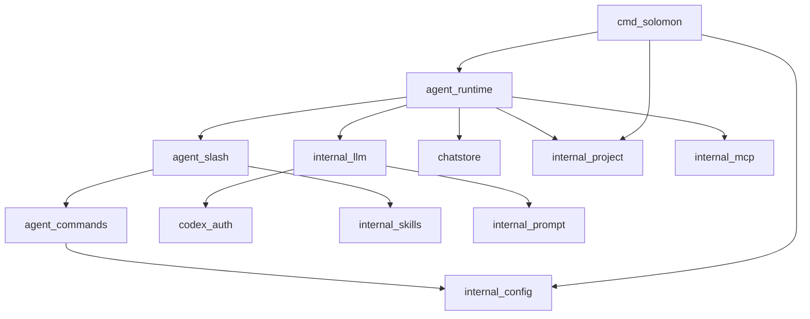

# Overview

> **Early release — preview software, not production-ready.** APIs, behavior, and on-disk formats may change without notice. Bring your own OpenAI-compatible endpoint · Expect rough edges · [Open an issue](https://github.com/SAPPHIR3-ROS3/Solomon/issues) with feedback

## What is Solomon

Solomon is a **local-first terminal agent**: one Go binary, your choice of LLM provider, project state under `~/.solomon`. It is not an IDE or a hosted service.

Interactive terminal harness for LLMs over OpenAI-compatible APIs — project-aware sessions, skills, slash commands, planning, and tooling.

- **Interactive REPL** — multiline input, slash commands, checkpoints, streaming output
- **Plan and build modes** — research and plan first (`/plan`), then implement with shell and file tools (`/build`)
- **Skills and MCP** — install skills with `solomon add`; optional MCP tools from `mcp.json`
- **Headless runs** — `solomon exec` and `--json` / `--jsonl` for scripts and CI
- **BYO API** — OpenAI-compatible HTTPS endpoints, Anthropic Messages API, or ChatGPT Sub via `/connect`

Data (config, chats, plans, skills) lives outside your repo in `~/.solomon`, keyed by workspace root.

## Purpose

Solomon is a terminal harness for OpenAI-compatible LLM APIs: project-scoped sessions, plan/build tool modes, skills, slash commands, optional MCP tools, and on-disk transcripts under `~/.solomon`.

## Design tenets

- **Local-first** — config, chats, plans, skills, and logs live under `~/.solomon`, keyed by canonical workspace root.
- **Bring-your-own API** — one binary; you choose `base_url`, API key, and model via TOML or `/connect`.
- **Explicit surfaces** — CLI modes (`exec`, `temp exec`, `add`/`remove`), REPL slash commands, separate plan vs build tooling, optional legacy XML tool calling for text-only backends.
- **Composable skills** — registry at global, project, and workspace scope; bound to slash or invoked as tools.
- **Optional observability** — reasoning streams, usage footers, structured file logs.

Compared to IDE-hosted or vendor-locked CLIs, Solomon keeps backend and workspace attachment under your control.

## Top-level layout

| Path | Role |
|------|------|
| `cmd/solomon/` | Single binary entry (`main.go`, `exec.go`) |
| `internal/agent/runtime/` | REPL, turns, persistence, MCP, Cursor — [Runtime hub](runtime.md) |
| `internal/agent/commands/` | Slash command implementations and `/connect` wizard |
| `internal/agent/tools/` | Native OpenAI tools (plan/build) |
| `internal/agent/toolenv/` | `Env` struct — runtime callbacks passed into tools |
| `internal/agent/slash/` | Slash parsing and dispatch (`dispatch.go`) |
| `internal/agent/slash_forward.go` | Public `agent.SlashDispatch` re-export |
| `internal/agent/cievents/` | CI event schema for `exec --json` / `--jsonl` |
| `internal/llm/` | Streaming, message params, usage, provider backends |
| `internal/auth/openai/codex/` | ChatGPT Sub OAuth (PKCE), token refresh, Codex middleware |
| `internal/prompt/` | System prompt templates (embedded defaults + `~/.solomon/prompts/templates/`) |
| `internal/chatstore/` | Session JSON I/O |
| `internal/mcp/` | MCP client manager and adapter |
| `internal/config/`, `internal/paths/`, `internal/project/` | Config and layout |
| `internal/providersetup/` | Provider-specific onboard flows (`/connect`, wizard) |
| `internal/skills/` | Skill registry and install |
| `internal/instructions/` | `AGENTS.md` / fallbacks loader and cache |
| `internal/checkpoint/` | Checkpoint sequences and labels |
| `internal/tooling/` | Legacy `<tool_calls>` XML parse/stream; shared invocation types |
| `internal/tooloutput/` | Tool result truncation and spill to `temp/` |
| `internal/atmention/` | `@` file/folder tags, short tags, picker scoring |
| `internal/search/` | Web search backends for `webSearch` |
| `internal/integrations/cursor/` | Cursor sidecar install paths and health |
| `integrations/cursor/` | Node sidecar — [Cursor integration](cursor-integration.md) |
| `internal/updater/` | GitHub release check, install, restart |
| `test/` | Integration and unit tests (package `test`) |

Full checklist with tiers: **[Package index](package-index.md)**.

## Package dependency graph

**Shape:** [`cmd/solomon/main.go`](../../cmd/solomon/main.go) loads config, resolves the project, builds `agentruntime.Runtime`, calls `InitMCP`, then `Run` (REPL) or `RunPromptOnce`. Runtime owns readline, slash bridge, chat turns, and session writes.

## Extension points

| Area | Hook |
|------|------|
| Slash commands | Register in [`commands/builtin_slash.go`](../../internal/agent/commands/builtin_slash.go) |
| Native tools | Add in `internal/agent/tools/` and wire in `params.go` / `exec.go` |
| MCP tools | Configure `mcp.json`; adapter exposes `MCP<server>-<tool>` names |
| Skills | `solomon add`, registry in `internal/skills/` |
| System prompts | Embedded defaults in `internal/prompt/templates/`; runtime copies under `~/.solomon/prompts/templates/`; SHA checks at REPL startup (`[prompt_templates]` in config) |
| Legacy tool calling | `[tools].legacy` / `legacy_force` in config or `/legacytools`; see [Agent turn pipeline](agent-turn-pipeline.md#legacy-xml-tool-calling) |
| Cursor native tools | `[tools].cursor_internal_tools` in config or `/cursortools` (Cursor API configured); see [Cursor integration](cursor-integration.md) |

## Related code

- [`cmd/solomon/main.go`](../../cmd/solomon/main.go)
- [`internal/agent/runtime/core.go`](../../internal/agent/runtime/core.go)

## See also

- [Installation and PATH](../user-guide/installation.md)
- [Usage and commands — Quickstart](../user-guide/usage-and-commands.md#quickstart)
- [Package index](package-index.md)
- [Runtime hub](runtime.md)
- [Startup and CLI](startup-and-cli.md)
- [Agent turn pipeline](agent-turn-pipeline.md)
- [Native tools](native-tools.md)
- [Data layout](../user-guide/data-layout.md)
