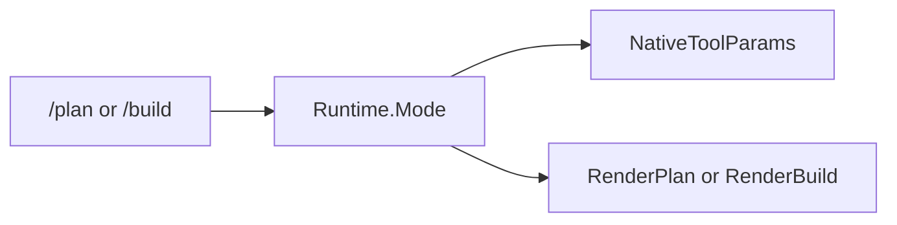

# Plan vs build

## Purpose

`Runtime.Mode` switches the native tool surface and the system prompt template between planning and implementation work.

## Mode values

| Mode | Set by | Native tools (OpenAI) |
|------|--------|------------------------|
| `plan` | `/plan`, default after some slash flows | `createPlan`, `editPlan`, `buildPlan` |
| `build` | `/build`, `NewRuntime` default | `shell`, `readFile`, `editFile`, `subagent`, `loadSkill`, `searchSkill`, `fetchWeb`, `webSearch` |

MCP tools append to both modes when connected ([`toolParams`](../../internal/agent/runtime/mcp.go)).

## Packages and files

| File | Role |
|------|------|
| `internal/agent/tools/params.go` | `NativeToolParams(mode)` |
| `internal/agent/tools/exec.go` | Mode guards in `dispatchInternal` |
| `internal/agent/runtime/core.go` | `systemPrompt` chooses `RenderPlan` vs `RenderBuild` |
| `internal/prompt/render.go` | Template render |
| `internal/prompt/templates/*.tmpl` | plan, build, title, summarize bodies |
| `internal/agent/commands/plan.go`, `build.go` | Slash mode switch |

## Key functions

| Function | Behavior |
|----------|----------|
| `NativeToolParams` | Returns tool schema slice for mode |
| `BuildPlanToolDump` / `BuildBuildToolDump` | Text dump embedded in system prompt |
| `prompt.RenderPlan` / `RenderBuild` | Fill template with tools, syntax, workspace path, language |
| `tools.Exec` | Rejects plan tools in build mode and vice versa |

## System prompt data

`prompt.Data` carries:

- `Tools` — concatenated native + MCP tool documentation dump
- `Syntax` — native invocation syntax; optional legacy XML append when `[tools].legacy` is enabled; legacy-only syntax when `[tools].legacy_force` is enabled
- `WorkspaceAbsolutePath` — canonical project root
- `Language`, `UserName`, `DisableThinking`
- `CustomRules`, `GlobalInstructions`, `RepoInstructions` — optional sections from [`internal/instructions`](../../internal/instructions/) (empty sections omitted from the rendered prompt)

Both plan and build templates include the same instruction sections when present. Subdirectory repo instructions appear only after session activation (build-mode tools: `readFile`, `editFile` including delete via `delete: true`, `shell`). Plan mode does not read arbitrary project files, so subdirectory activation typically happens after switching to `/build`.

When `[tools].legacy_force` is enabled, native OpenAI tool schemas are omitted from LLM requests in both modes; the model must use legacy XML described in the system prompt. With `legacy` only (not force), native API calls are preferred and XML is a fallback.

See [Project instructions](../user-guide/project-instructions.md).

## Flow

## Extension points

- Add a tool to one mode: extend `params.go`, `exec.go` switch, and matching `*_openai.go` schema; update dump builders in `dump_plan.go` / `dump_build.go`.
- Template copy: edit `internal/prompt/templates/`.

## Related code

- [`internal/agent/tools/params.go`](../../internal/agent/tools/params.go)
- [`internal/prompt/render.go`](../../internal/prompt/render.go)

## See also

- [Native tools](native-tools.md)
- [Agent turn pipeline](agent-turn-pipeline.md)
- [Usage and commands](../user-guide/usage-and-commands.md)
