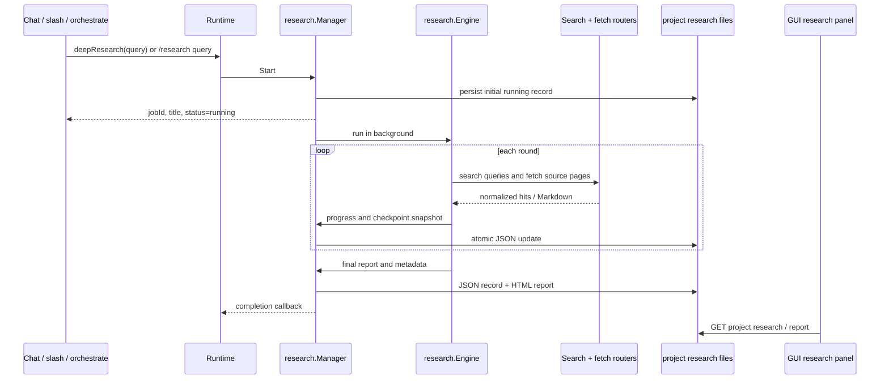

# Deep research

## Purpose

Deep research is Solomon's asynchronous, project-scoped workflow for answering
a question with multiple web searches, page extraction, evidence synthesis,
and a persisted HTML report. It is a native capability at the chat surface
and a deferred capability in agent mode; both paths use the same runtime and
research manager.

## Lifecycle



`deepResearch` returns as soon as the job has been registered. The caller uses
`researchStatus` or `/research status` to inspect progress; completion is also
reported asynchronously in the terminal unless machine-output mode is active.
An ephemeral session cannot start a persisted research job because there is no
project partition in which to store its checkpoint and report.

## Surfaces

| Surface | Entry point | Behavior |
|---------|-------------|----------|
| Chat native tools | `deepResearch`, `researchStatus` | Start a background job and inspect it by `jobId` |
| Agent / Code Mode | deferred research entries | Discover with `searchTools`, then execute through `orchestrate` |
| Terminal REPL | `/research` | Start, list, inspect, cancel, delete, and resume jobs |
| GUI | Deep research tab in the right panel | List project jobs and open a completed HTML report |
| Local server | `GET /__solomon/projects/<project>/research` | Return persisted job metadata |
| Local server | `GET /__solomon/projects/<project>/research/<id>/report` | Return the persisted report HTML |

The GUI reads the same files as the terminal and does not create a second
research store. Starting or controlling a job remains available through chat
tools or `/research`; selecting a job in the GUI opens its report view.

## Job state and controls

Statuses are `running`, `paused`, `done`, `failed`, and `cancelled`. Progress
phases are `planning`, `searching`, `reading`, `analyzing`, `writing`, and
`error`. A paused job retains its plan, findings, used queries, fetched URLs,
and URL-attempt metadata so `/research resume <id|title>` can continue it.

The slash command accepts a job id, slug, or title (titles are
case-insensitive):

```text
/research <query>
/research list
/research status <id|title>
/research stop <id|title>
/research delete <id|title>
/research resume <id|title>
```

`stop` and `cancel` request cancellation of the live job. `delete` removes
both the JSON record and the HTML report. `/research` without an argument is
equivalent to `list`; `remove`, `rm`, `continue`, and `cancel` are accepted
aliases where applicable.

## Engine and limits

Each run performs the following high-level work:

1. Build a research plan and classify the question when the category was not
   supplied.
2. Generate fresh queries for each round, avoiding queries already used.
3. Search, deduplicate URLs, fetch pages, and extract source-backed findings.
4. Synthesize an evolving report and decide whether another round is useful.
5. Render the final Markdown report as HTML and append a TL;DR section.

The user-facing limits are configured in `config.toml`:

| Key | Default | Meaning |
|-----|---------|---------|
| `research_max_rounds` | `8` | Maximum search/synthesis rounds |
| `research_max_urls_per_round` | `3` | Maximum new source URLs read per round |
| `research_max_content_chars` | `15000` | Maximum page Markdown sent to extraction per URL |
| `subagent_timeout_minutes` | `20` | Overall research time budget, in minutes |

The engine treats an empty result set as a failure when it cannot gather any
findings, and records URL-level failures instead of silently presenting a
successful-looking report. The final job record contains search/fetch
metadata, source findings, usage statistics, and the last error when a run
fails or pauses.

## Web backend routing

When `web_search_engine = "internal"`, the engine uses the runtime-injected
search and fetch routers. The routers read host-managed `internal` entries
from `mcp.json` and construct only the known `exa` and `parallel` adapters.
Those MCP tools stay behind the manager and are never exposed as generic model
tools. If both primary adapters fail, the native CloakBrowser adapter opens an
isolated tab for the single request, extracts the result, and closes the tab.

Search and fetch share the persisted balance file
`~/.solomon/websearch-usage.json`. A primary attempt is reserved before the
call, so failures count toward usage. The scheduler prefers the backend with
the lower count, remembers the backend that should be tried next after a
fallback, and clears counts and preference when the UTC month changes. If the
file cannot be updated, a process-local volatile store preserves routing for
the current process.

Every normalized result carries provider/adapter, fallback, and attempt
metadata where the backend supports it. The research engine also stores URL
attempt outcomes such as fetch failure, empty content, extraction failure,
low-quality content, and successful extraction.

## Persistence and concurrency

Project records are stored at:

```text
~/.solomon/projects/<project-id>/research/<slug>.json
~/.solomon/projects/<project-id>/research/<slug>.html
```

The manager owns the in-memory active-record map and protects it with a
mutex. The background engine never mutates a record that is visible to a
status caller. Each progress or terminal update clones the record and all
its slices while holding the lock, replaces the stored snapshot, unlocks,
and then persists the independent value. `Get`, `Start`, `Resume`, and
callbacks also receive independent snapshots.

This contract is required because the terminal and GUI can poll status while
the research goroutine is updating progress. It prevents the Linux race
detector failure that occurred when `ResearchStatus` read a `JobRecord` while
`updateProgress` wrote it.

## Code map

| Area | Entry point |
|------|-------------|
| Job lifecycle | [`internal/research/job.go`](../../internal/research/job.go) |
| Engine rounds and synthesis | [`internal/research/engine.go`](../../internal/research/engine.go) |
| Web routing | [`internal/research/web.go`](../../internal/research/web.go), [`internal/search/router.go`](../../internal/search/router.go), [`internal/webfetch/router.go`](../../internal/webfetch/router.go) |
| Runtime callbacks | [`internal/agent/runtime/researchmanager.go`](../../internal/agent/runtime/researchmanager.go) |
| Native tool handlers | [`internal/agent/tools/deep_research.go`](../../internal/agent/tools/deep_research.go), [`internal/agent/tools/research_status.go`](../../internal/agent/tools/research_status.go) |
| Slash command | [`internal/agent/commands/research.go`](../../internal/agent/commands/research.go) |
| HTTP project API | [`internal/server/project_api.go`](../../internal/server/project_api.go) |
| HTML renderer | [`internal/research/html/`](../../internal/research/html/) |
| Cross-surface regression | [`test/web_surfaces_test.go`](../../test/web_surfaces_test.go) |

## See also

- [Native tools](native-tools.md)
- [MCP integration](mcp-integration.md)
- [Runtime — orchestration](runtime-orchestration.md)
- [Data layout](../user-guide/data-layout.md)
- [Configuration — deep research](../user-guide/configuration.md#deep-research)
