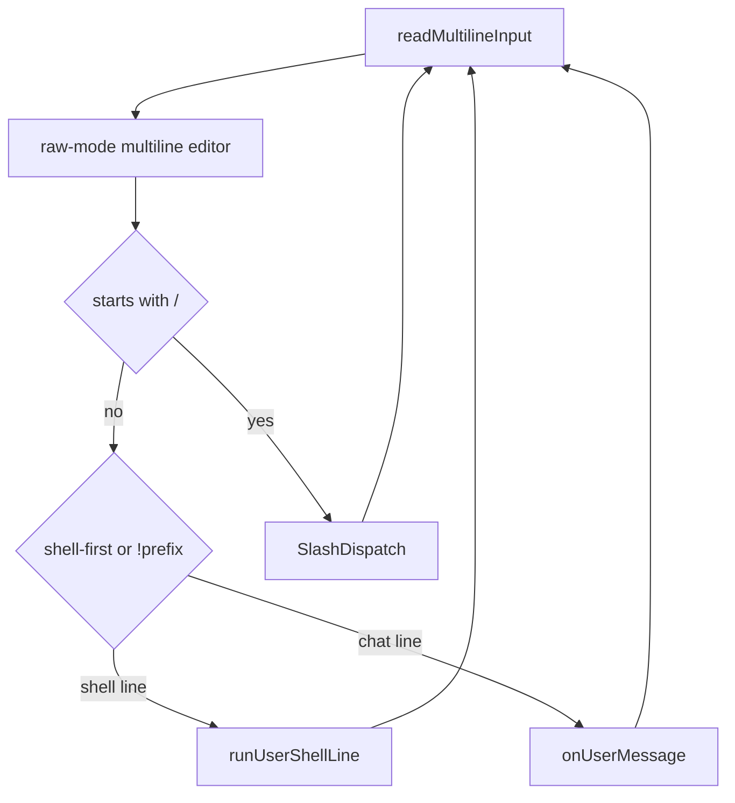

# Runtime and REPL

## Purpose

The interactive REPL loop: multiline input handling, slash commands, shell-first mode, clipboard images, and delegation to the agent turn pipeline.

## Packages and files

| Package / file | Responsibility |
|----------------|----------------|
| `internal/agent/runtime/repl/loop.go` | `Run`, line dispatch, slash/shell/chat routing |
| `internal/agent/runtime/repl/editor.go` | Raw-mode multiline editor: key handling, text buffer, history navigation |
| `internal/agent/runtime/repl/editor_render.go` | REPL input redraw and cursor positioning |
| `internal/agent/runtime/slash_bridge.go` | Build `commands.Deps`, call `SlashDispatch` |
| `internal/agent/runtime/multiline/translator.go` | Bracketed paste, soft newline, and terminal mode helpers |
| `internal/agent/runtime/shell.go` | `!command` local shell execution |
| `internal/agent/runtime/welcome_banner.go` | Startup banner and git branch hint |
| `internal/agent/slash.go` | Parse `/cmd args`, intercept forced `/skill:<name>`, dispatch registry |
| `internal/agent/commands/*` | Slash implementations |

## Key types and functions

| Symbol | Behavior |
|--------|----------|
| `Runtime.Run` | Finish session load, banner, terminal input modes, REPL loop |
| `readMultilineInput` | Read raw terminal input and return a complete message string |
| `multilineEditor` | Own the editable `[][]rune` buffer, cursor row/column, history, paste, and completion |
| `Runtime.handleSlash` (via bridge) | Slash lines do not enter LLM until command completes |
| `solomonagent.SlashDispatch` | Tokenize slash line, handle forced `/skill:<name>` path, then lookup `commands.Registry` |
| `splitSlashArgs` | Quote-aware slash argument split |
| `onUserMessage` / `onUserMessageWithAPIContent` | Append user msg, optionally keep visible text distinct from API payload, persist, `runAgentTurns` |
| `runUserShellLine` | Run `!` prefixed shell in project root |
| bracketed paste / clipboard hook | Paste text or clipboard image tags into the editor buffer |

## REPL flow

`SlashDispatch` includes a dedicated early branch for `/skill:<name> [request]`: the visible line stays unchanged in the transcript, while the expanded prompt with the resolved skill body is stored separately and used for the API call.

## REPL input model

The main REPL input no longer delegates editing to `readline.Readline()`. Solomon still keeps the `readline.Instance` for terminal writers, width configuration, and compatibility with surrounding runtime setup, but the prompt input itself is read in raw mode.

`multilineEditor` stores the draft as `[][]rune` plus a cursor row/column. Arrow keys edit that buffer directly: Up/Down move between draft lines, while history navigation is only entered from the first/last line. The renderer tracks how many visual terminal rows it drew, clears exactly that input block, redraws all prompt lines, and then moves the cursor back to the calculated visual cell.

Tab completion reuses the existing `replcomplete` package, but the editor inserts the completion suffix into its own buffer instead of using readline's completion renderer.

## `Runtime` fields (REPL-relevant)

| Field | Role |
|-------|------|
| `RL` | readline instance kept for terminal writers/configuration; main prompt editing is owned by `multilineEditor` |
| `Mode` | `plan` or `build` — affects tools and system prompt |
| `Cfg.Tools` | Global `[tools].legacy` / `legacy_force` (also `/legacytools`); affects API tool schemas and prompt syntax |
| `ReplShellFirst` | Non-`!` lines run as shell when set |
| `EphemeralSession` | In-memory transcript only; see [Ephemeral session](#ephemeral-session) |
| `Out` | Assistant and tool output stream |

## Ephemeral session

When `EphemeralSession` is true, `persistSession` does not write `chatstore` JSON to disk (see [Sessions and storage](sessions-and-storage.md)).

| Entry | Behavior |
| ----- | -------- |
| `solomon temp exec <prompt>` | One-shot run; flag set at startup in [`cmd/solomon/main.go`](../../cmd/solomon/main.go) |
| `/temp` | REPL only, via [`commands.TempChat`](../../internal/agent/commands/resume.go): allowed only if the current chat has **no messages**; sets `EphemeralSession` and resets an in-memory session. If messages are already present, Solomon prints an error and does not switch mode. |
| `/new`, `/resume` | Clear ephemeral mode and return to normal persisted chats |

## Extension points

- Slash: register in `commands` and `builtin_slash.go`.
- REPL keys: extend `multilineEditor.handle` / `handleSeq`; keep redraw changes inside `editor_render.go`.

## Related code

- [`internal/agent/runtime/repl/loop.go`](../../internal/agent/runtime/repl/loop.go)
- [`internal/agent/runtime/repl/editor.go`](../../internal/agent/runtime/repl/editor.go)
- [`internal/agent/slash.go`](../../internal/agent/slash.go)

## See also

- [Agent turn pipeline](agent-turn-pipeline.md)
- [Skills and slash](skills-and-slash.md)
- [Usage and commands](../user-guide/usage-and-commands.md)
- [Terminal setup](../user-guide/terminal-setup.md)
