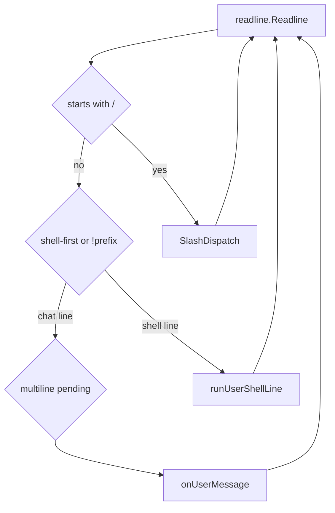

# Runtime and REPL

## Purpose

The interactive readline loop: input handling, slash commands, multiline paste, shell-first mode, clipboard images, and delegation to the agent turn pipeline.

## Packages and files

| Package / file | Responsibility |
|----------------|----------------|
| `internal/agent/runtime/repl.go` | `Run`, readline listener, line dispatch |
| `internal/agent/runtime/slash_bridge.go` | Build `commands.Deps`, call `SlashDispatch` |
| `internal/agent/runtime/multiline.go` | Multiline accumulation, control runes |
| `internal/agent/runtime/shell.go` | `!command` local shell execution |
| `internal/agent/runtime/welcome_banner.go` | Startup banner and git branch hint |
| `internal/agent/slash.go` | Parse `/cmd args`, dispatch registry |
| `internal/agent/commands/*` | Slash implementations |

## Key types and functions

| Symbol | Behavior |
|--------|----------|
| `Runtime.Run` | Finish session load, banner, bracketed paste, readline loop |
| `Runtime.handleSlash` (via bridge) | Slash lines do not enter LLM until command completes |
| `solomonagent.SlashDispatch` | Tokenize slash line, lookup `commands.Registry` |
| `splitSlashArgs` | Quote-aware slash argument split |
| `onUserMessage` | Append user msg, persist, `runAgentTurns` |
| `runUserShellLine` | Run `!` prefixed shell in project root |
| readline key `22` (Ctrl+V) | Paste clipboard image → `[img-N]` tag + file under chat images dir |

## REPL flow

## `Runtime` fields (REPL-relevant)

| Field | Role |
|-------|------|
| `RL` | readline instance; prompt includes checkpoint prefix |
| `Mode` | `plan` or `build` — affects tools and system prompt |
| `ReplShellFirst` | Non-`!` lines run as shell when set |
| `EphemeralSession` | In-memory transcript only; see [Ephemeral session](#ephemeral-session) |
| `Out` | Assistant and tool output stream |

## Ephemeral session

When `EphemeralSession` is true, `persistSession` does not write `chatstore` JSON to disk (see [Sessions and storage](sessions-and-storage.md)).

| Entry | Behavior |
| ----- | -------- |
| `solomon temp exec <prompt>` | One-shot run; flag set at startup in [`cmd/solomon/main.go`](../../cmd/solomon/main.go) |
| `/temp` | REPL only, via [`commands.TempChat`](../../internal/agent/commands/resume.go): allowed only if the current chat has **no messages**; sets `EphemeralSession` and resets an in-memory session. If messages are already present, Solomon prints an error and does not switch mode. |
| `/new`, `/resume` | Clear ephemeral mode and return to normal persisted chats |

## Extension points

- Slash: register in `commands` and `builtin_slash.go`.
- REPL keys: extend `cfg.Listener` in `repl.go` (e.g. image paste already uses key 22).

## Related code

- [`internal/agent/runtime/repl.go`](../../internal/agent/runtime/repl.go)
- [`internal/agent/slash.go`](../../internal/agent/slash.go)

## See also

- [Agent turn pipeline](agent-turn-pipeline.md)
- [Skills and slash](skills-and-slash.md)
- [Usage and commands](../user-guide/usage-and-commands.md)
