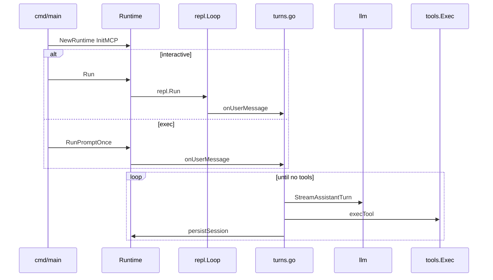

# Runtime — orchestration

## Purpose

LLM turns, tool execution, persistence, MCP, checkpoints, nested subagents, and machine-output mode — everything in [`internal/agent/runtime/`](../../internal/agent/runtime/) that is **not** the REPL editor. REPL wiring: [Runtime — REPL input](runtime-repl.md). Index: [Runtime hub](runtime.md).

## Lifecycle

## Core and session I/O

| File | Key symbols |
|------|-------------|
| [`core.go`](../../internal/agent/runtime/core.go) | `NewRuntime`, `RunPromptOnce`, `systemPrompt`, `persistSession`, `mutateSession` |
| [`deferred_chat_title.go`](../../internal/agent/runtime/deferred_chat_title.go) | `scheduleDeferredChatTitleFinalize` after first turn with placeholder chat id |

`systemPrompt` chooses plan vs build templates, injects instructions, rules, tool dumps, MCP dump, legacy syntax. See [Plan vs build](plan-vs-build.md).

## Turn pipeline

| File | Key symbols |
|------|-------------|
| [`turns.go`](../../internal/agent/runtime/turns.go) | `onUserMessage`, `onUserMessageWithAPIContent`, `runAgentTurns` |
| [`legacy.go`](../../internal/agent/runtime/legacy.go) | `ResolveTurnInvocations`, legacy enable/force helpers |
| [`tool_print.go`](../../internal/agent/runtime/tool_print.go) | Tool intent lines, legacy stream writer, model correction messages |
| [`exec.go`](../../internal/agent/runtime/exec.go) | `execTool`, `toolEnv` |

Deep sequence: [Agent turn pipeline](agent-turn-pipeline.md).

### Nested subagent

[`nested.go`](../../internal/agent/runtime/nested.go) runs an isolated stream for the `subagent` tool:

| Function | Behavior |
|----------|----------|
| `runNested` | Build-mode system prompt + task string |
| `runNestedWithSystem` | Custom `sysPromptPath` merged with inherited instructions |
| `buildNestedToolDump` | Build tools + MCP dump for nested context |

Returns consolidated text to the parent tool result. Background runs persist their subchat and can be stopped, cancelled, interrupted-and-resumed, or resumed later; see [Sessions and storage](sessions-and-storage.md). Wired from [`tools/subagent.go`](../../internal/agent/tools/subagent.go).

Optional **`roleProvider`** / **`roleModel`** select a row from `[[roles.subagent]]` (discovered via `listSubAgents`); the nested stream uses that provider’s backend and model instead of the session defaults. Background subagents validate the role **before** persisting the subsession. See [Native tools — subagent roles](native-tools.md#subagent-roles).

## MCP

| File | Key symbols |
|------|-------------|
| [`mcp.go`](../../internal/agent/runtime/mcp.go) | `InitMCP`, append MCP schemas to `toolParams` |

Started asynchronously from `Run`. Detail: [MCP integration](mcp-integration.md).

## Checkpoints and instructions

| File | Key symbols |
|------|-------------|
| [`checkpoint.go`](../../internal/agent/runtime/checkpoint.go) | `ApplyGotoCheckpoint`, coordinate edit staging restore |
| [`instructions.go`](../../internal/agent/runtime/instructions.go) | `activateInstructionsFromAbsPath`, `activateInstructionsFromShellCommand` |

Checkpoints: [Checkpoints](checkpoints.md). Instructions: [Project instructions](../user-guide/project-instructions.md).

## CI / machine output

| File | Key symbols |
|------|-------------|
| [`ci_run.go`](../../internal/agent/runtime/ci_run.go) | `runPromptOnceCI`, `ciEmit`, `streamOptsCI`, exit metadata |

Active when `Runtime.EventSink` is set (`solomon exec --json` / `--jsonl`). Schema: [`internal/agent/cievents/`](../../internal/agent/cievents/). User guide: [Machine output](../user-guide/usage-and-commands.md#machine-readable-output---json---jsonl).

## Cursor integration (runtime hooks)

| File | Role |
|------|------|
| [`cursor_sidecar.go`](../../internal/agent/runtime/cursor_sidecar.go) | Ensure Node sidecar for Cursor API provider |
| [`cursor_native_display.go`](../../internal/agent/runtime/cursor_native_display.go) | REPL lines for `solomon_cursor_tool_event` when native tools enabled |

Full design, HTTP API, bridge table, debug playbook: **[Cursor integration](cursor-integration.md)**.

## Updates and restart

| File | Role |
|------|------|
| [`update.go`](../../internal/agent/runtime/update.go) | `refreshUpdateCheck`, `tryAutoUpdateInstall` (startup install + restart), `/update` |
| [`restart.go`](../../internal/agent/runtime/restart.go) | `ErrRestartSolomon` — `/upgrade` triggers re-exec in `cmd` |

Backend: [`internal/updater/`](../../internal/updater/).

## `onUserMessage` vs visible text

`onUserMessageWithAPIContent(visible, apiContent)` supports:

- `@` mention expansion (visible tags vs expanded file bodies)
- Forced `/skill:` (visible slash vs expanded skill body)

Both paths bump checkpoint, append user message, persist, then `runAgentTurns`.

## Extension points

| Change | Files |
|--------|-------|
| New native tool | `internal/agent/tools/` + [`exec.go`](../../internal/agent/runtime/exec.go) env |
| Turn behavior | [`turns.go`](../../internal/agent/runtime/turns.go) |
| Persist rules | [`core.go`](../../internal/agent/runtime/core.go) `persistSession` |
| MCP wiring | [`mcp.go`](../../internal/agent/runtime/mcp.go) |

## Related tests

| Area | Tests |
|------|-------|
| Turn loop / legacy | [`test/legacy_runtime_test.go`](../../test/legacy_runtime_test.go), [`test/legacy_tools_test.go`](../../test/legacy_tools_test.go) |
| Checkpoints | [`test/checkpoint_truncate_test.go`](../../test/checkpoint_truncate_test.go), [`test/checkpoint_staging_test.go`](../../test/checkpoint_staging_test.go) |
| CI events | [`test/cievents_test.go`](../../test/cievents_test.go) |
| Tool display | [`test/tool_display_checkpoint_test.go`](../../test/tool_display_checkpoint_test.go) |
| Instructions | [`test/instructions_test.go`](../../test/instructions_test.go), [`test/instructions_prompt_test.go`](../../test/instructions_prompt_test.go) |

Full map: [Runtime hub — Debug playbook](runtime.md#debug-playbook).

## See also

- [Agent turn pipeline](agent-turn-pipeline.md)
- [LLM layer](llm-layer.md)
- [Native tools](native-tools.md)
- [Runtime hub](runtime.md)
