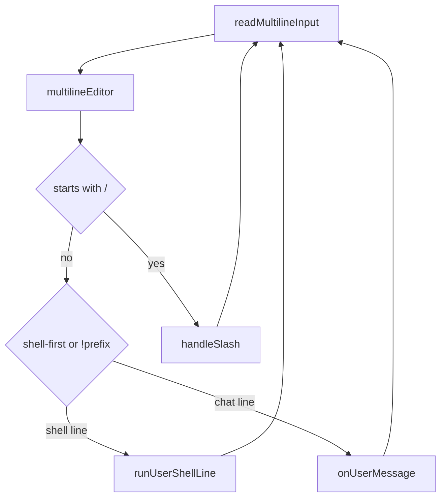

# Runtime — REPL input

## Purpose

Interactive input UX under [`internal/agent/runtime/repl/`](../../internal/agent/runtime/repl/) and related packages. Orchestration callbacks live in [`repl_run.go`](../../internal/agent/runtime/repl_run.go); turn execution is in [Runtime — orchestration](runtime-orchestration.md).

Index: [Runtime hub](runtime.md).

## Entry and loop

| File | Role |
|------|------|
| [`repl_run.go`](../../internal/agent/runtime/repl_run.go) | `Runtime.Run` — welcome banner, MCP prefetch, builds `repl.Loop` |
| [`repl/loop.go`](../../internal/agent/runtime/repl/loop.go) | Main loop: read line → slash / shell / chat dispatch |
| [`repl/readline.go`](../../internal/agent/runtime/repl/readline.go) | readline instance helpers (width, prompt writers) |
| [`repl/banner.go`](../../internal/agent/runtime/repl/banner.go) | Welcome banner, update notice, git branch hint |
| [`repl/imgtags.go`](../../internal/agent/runtime/repl/imgtags.go) | Colorize `[img-N]` tags and strip paste-image trigger |
| [`repl/git_branch.go`](../../internal/agent/runtime/repl/git_branch.go) | Git branch name for banner |

## Raw-mode multiline editor

| File | Role |
|------|------|
| [`repl/editor/read.go`](../../internal/agent/runtime/repl/editor/read.go) | `multilineEditor` — buffer `[][]rune`, keys, history, completion, `@` picker hooks |
| [`repl/editor/refresh.go`](../../internal/agent/runtime/repl/editor/refresh.go) | Redraw input block, cursor positioning |
| [`repl/editor/stdin_unix.go`](../../internal/agent/runtime/repl/editor/stdin_unix.go) | Unix stdin for editor |
| [`repl/editor/stdin_windows.go`](../../internal/agent/runtime/repl/editor/stdin_windows.go) | Windows stdin for editor |
| [`repl/editor/editorhistory.go`](../../internal/agent/runtime/repl/editor/editorhistory.go) | Test exports for editor behavior (`test/repl_editor_test.go`) |
| [`repl/editor/history.go`](../../internal/agent/runtime/repl/editor/history.go) | Per-session input history (Up/Down from first/last line) |
| [`repl/paste.go`](../../internal/agent/runtime/repl/paste.go) | Bracketed paste and text insertion |
| [`repl/editor/autosuggest.go`](../../internal/agent/runtime/repl/editor/autosuggest.go) | Ghost-text suggestions from history (disable: `SOLOMON_NO_AUTOSUGGEST=1`) |

The REPL does **not** use readline for the main prompt buffer. readline remains for terminal configuration and legacy prompt helpers.

### Input model

`multilineEditor` stores the draft as `[][]rune` with row/column cursor. Arrow keys edit the draft; history navigation only from the first or last line. Modified Enter (Alt/Ctrl+Enter) inserts newlines when the terminal sends a distinct sequence.

Text editing in the REPL should behave like a normal text editor wherever the terminal allows it. Do not add custom internal scrolling or hidden viewports for message text; if inline terminal editing cannot provide a standard editor-like behavior for a large draft, use an explicit fallback such as opening the configured editor instead.

## REPL flow

Forced `/skill:<name> [request]` keeps the visible transcript line; expanded body goes to `Message.APIContent` via orchestration — see [Skills and slash](skills-and-slash.md#forced-skill-slash).

## Slash wiring

| File | Role |
|------|------|
| [`slash_deps.go`](../../internal/agent/runtime/slash_deps.go) | Build `commands.Deps`, `handleSlash` → `slash.Dispatch` |
| [`internal/agent/slash/dispatch.go`](../../internal/agent/slash/dispatch.go) | Parse slash line, registry lookup |

## Shell lines

| File | Role |
|------|------|
| [`usershell.go`](../../internal/agent/runtime/usershell.go) | Execute `!command` or shell-first plain lines in project root |
| [`repl/shellhist/`](../../internal/agent/runtime/repl/shellhist/) | Persist shell command history |
| [`repl/shelllex/`](../../internal/agent/runtime/repl/shelllex/) | Lex shell words for highlight and completion |

## Tab completion (`replcomplete`)

| File | Behavior |
|------|----------|
| [`replcomplete/slash_names.go`](../../internal/agent/runtime/replcomplete/slash_names.go) | Built-in and skill names after `/` |
| [`replcomplete/slash_args.go`](../../internal/agent/runtime/replcomplete/slash_args.go) | First-arg hints (`/log`, `/add`, `/goto`, …) |
| [`replcomplete/tabcompletions.go`](../../internal/agent/runtime/replcomplete/tabcompletions.go) | PATH binaries, pipes, operators |
| [`replcomplete/go.go`](../../internal/agent/runtime/replcomplete/go.go) | `go` subcommands |
| [`replcomplete/path.go`](../../internal/agent/runtime/replcomplete/path.go) | Workspace file paths |
| [`replcomplete/atmention.go`](../../internal/agent/runtime/replcomplete/atmention.go) | Workspace index for `@` picker |
| [`replcomplete/completer.go`](../../internal/agent/runtime/replcomplete/completer.go) | Shared completion merge |
| [`replcomplete/suggest.go`](../../internal/agent/runtime/replcomplete/suggest.go) | Slash suggestion at cursor (`SlashSuggestAt`, `SlashContextAt`) |
| [`replcomplete/slash_context.go`](../../internal/agent/runtime/replcomplete/slash_context.go) | Parse slash command at cursor; enumerate slash tokens in a line |
| [`replcomplete/env.go`](../../internal/agent/runtime/replcomplete/env.go) | `ReplCompleteEnv` struct |
| [`replcomplete_runtime.go`](../../internal/agent/runtime/replcomplete_runtime.go) | `EnvFrom(Runtime)` wiring |

Tab inserts the suffix into the editor buffer (not readline's renderer). Slash completion resolves the `/command` under the cursor (mid-line text before the cursor is preserved). Disable: `SOLOMON_NO_COMPLETE=1`.

## `@` file and folder mentions

| File | Role |
|------|------|
| [`repl/editor/at_picker.go`](../../internal/agent/runtime/repl/editor/at_picker.go) | Picker UI in editor when cursor inside `@` token |
| [`internal/atmention/`](../../internal/atmention/) | Tag parsing, `ShortTag`, query scoring |

On send, runtime expands tags into `Message.APIContent`; visible transcript keeps short tags. Tests: [`test/atmention_test.go`](../../test/atmention_test.go), [`test/repl_complete_path_test.go`](../../test/repl_complete_path_test.go).

## Input highlight (`replhl`)

| File | Role |
|------|------|
| [`repl/replhl/classify.go`](../../internal/agent/runtime/repl/replhl/classify.go) | Classify line: slash, shell, `@`, chat |
| [`repl/replhl/highlight.go`](../../internal/agent/runtime/repl/replhl/highlight.go) | Apply dim ANSI spans |
| [`repl/replhl/syntaxhighlighting.go`](../../internal/agent/runtime/repl/replhl/syntaxhighlighting.go) | Shell lexical highlight |
| [`repl/replhl/slash.go`](../../internal/agent/runtime/repl/replhl/slash.go) | Slash highlight (all slash tokens in line, cursor-aware args) |
| [`repl/replhl/span.go`](../../internal/agent/runtime/repl/replhl/span.go) | Span utilities |

Tests: [`test/repl_highlight_test.go`](../../test/repl_highlight_test.go).

## Multiline terminal modes

| File | Role |
|------|------|
| [`multiline/translator.go`](../../internal/agent/runtime/multiline/translator.go) | Bracketed paste, soft newline, REPL input mode setup |
| [`multiline/stdin_unix.go`](../../internal/agent/runtime/multiline/stdin_unix.go) | Unix console input restore |
| [`multiline/stdin_windows.go`](../../internal/agent/runtime/multiline/stdin_windows.go) | Windows console input |

Clipboard images: **Ctrl+V** in the raw-mode editor → [`repl_run.go`](../../internal/agent/runtime/repl_run.go) `saveReplClipboardImage` → session `[img-n]` tags. See [Terminal setup — Multiline input](../user-guide/terminal-setup.md#multiline-input-interactive-repl).

## REPL startup

| Step | Behavior |
| ---- | -------- |
| Update check | GitHub release compare before the banner; with `autoupdate=true` and a newer tag, install runs immediately and Solomon exits to restart in the same terminal |
| Welcome banner | Clamped to terminal width; omits inline update hint when autoupdate will install |
| MCP | `InitMCP` in a background goroutine; connection summary goes to the log file, not the REPL transcript |
| Model catalog | `PrefetchSlashModelCatalog` when onboarding is complete |
| Connectivity | `BeginStartupConnectivityCheck` — HTTPS reachability probes; offline notice deferred until the prompt is ready (input can interrupt the wait); first `/models` after offline startup refetches catalogs |

Implementation: [`repl_run.go`](../../internal/agent/runtime/repl_run.go), [`commands/testweb.go`](../../internal/agent/commands/testweb.go).

## REPL-relevant `Runtime` fields

| Field | Role |
|-------|------|
| `RL` | readline instance (writers/width) |
| `Mode` | `plan` or `build` |
| `Cfg.Tools` | Legacy XML flags (`/legacytools`); deprecated Cursor native tools (`/cursortools`, Cursor API configured) |
| `replInputPrefill` | Deferred slash prefill applied on next prompt read ([`repl_input.go`](../../internal/agent/runtime/repl_input.go)) |
| `ReplShellFirst` | Invert shell vs chat default |
| `EphemeralSession` | In-memory transcript only |
| `Out` | Assistant and tool stream |

## Ephemeral session

When `EphemeralSession` is true, `persistSession` skips disk writes ([Sessions and storage](sessions-and-storage.md)).

| Entry | Behavior |
| ----- | -------- |
| `solomon temp exec` | Set at startup in [`cmd/solomon/main.go`](../../cmd/solomon/main.go) |
| `/temp` | Only on empty chat — [`commands.TempChat`](../../internal/agent/commands/resume.go) |
| `/new`, `/resume` | Return to persisted chats |
| `/export` | Markdown transcript export — [`commands/export.go`](../../internal/agent/commands/export.go) |

## Extension points

- Keys: `multilineEditor.handle` / `handleSeq` in [`read.go`](../../internal/agent/runtime/repl/editor/read.go)
- Redraw: [`refresh.go`](../../internal/agent/runtime/repl/editor/refresh.go)
- Completion source: add candidate func under [`replcomplete/`](../../internal/agent/runtime/replcomplete/)

## See also

- [Runtime hub](runtime.md)
- [Runtime — orchestration](runtime-orchestration.md)
- [Skills and slash](skills-and-slash.md)
- [Terminal setup](../user-guide/terminal-setup.md)
