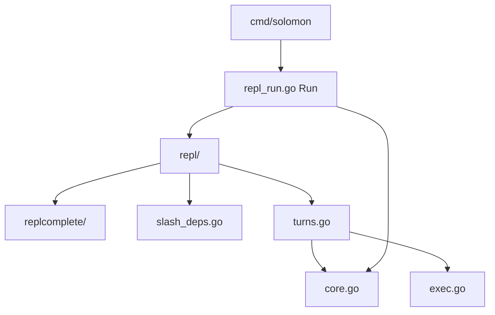

# Runtime hub

## Purpose

[`internal/agent/runtime/`](../../internal/agent/runtime/) is Solomon's orchestration core: the `Runtime` type, REPL loop wiring, LLM turn execution, tool dispatch, MCP, checkpoints, and integrations. This page is the **index**; detail lives in linked articles.

## Subpackages (shape)

**Flow:** `Runtime.Run` ([`repl_run.go`](../../internal/agent/runtime/repl_run.go)) builds a [`repl.Loop`](../../internal/agent/runtime/repl/loop.go). Chat lines call `onUserMessage` → [`runAgentTurns`](../../internal/agent/runtime/turns.go) in [`turns.go`](../../internal/agent/runtime/turns.go). Slash lines call [`slash_deps.handleSlash`](../../internal/agent/runtime/slash_deps.go) → [`slash.Dispatch`](../../internal/agent/slash/dispatch.go).

## Articles

| Article | Topics |
|---------|--------|
| [Runtime — REPL input](runtime-repl.md) | Raw-mode editor, completion, `@` mentions, highlight, shell history |
| [Runtime — orchestration](runtime-orchestration.md) | Turns, tools, MCP, legacy XML, nested subagent, CI mode, checkpoints |
| [Agent turn pipeline](agent-turn-pipeline.md) | Stream loop sequence, compaction, legacy XML rules |
| [Checkpoints](checkpoints.md) | `/goto`, staging, file restore |

## Root file map

| File | Responsibility | Called from / calls |
|------|----------------|---------------------|
| [`core.go`](../../internal/agent/runtime/core.go) | `Runtime` struct, `NewRuntime`, `RunPromptOnce`, `systemPrompt`, `persistSession`, session mutation | `cmd`, REPL callbacks, `turns` |
| [`repl_run.go`](../../internal/agent/runtime/repl_run.go) | `Run` — banner, MCP goroutine, `repl.Loop` wiring, clipboard hooks | `cmd` |
| [`turns.go`](../../internal/agent/runtime/turns.go) | `onUserMessage`, `runAgentTurns`, stream + tool loop, SIGINT cancel | `repl/loop`, `RunPromptOnce` |
| [`exec.go`](../../internal/agent/runtime/exec.go) | `execTool`, `toolEnv` → `tools.Exec` | `turns` |
| [`legacy.go`](../../internal/agent/runtime/legacy.go) | `ResolveTurnInvocations`, legacy config helpers | `turns` |
| [`tool_print.go`](../../internal/agent/runtime/tool_print.go) | Terminal tool lines, legacy stream writer setup, correction messages | `turns` |
| [`nested.go`](../../internal/agent/runtime/nested.go) | `runNested`, subagent stream (build tools + optional custom prompt) | `tools/subagent` |
| [`mcp.go`](../../internal/agent/runtime/mcp.go) | `InitMCP`, MCP tools in `toolParams` | `Run`, `turns` |
| [`slash_deps.go`](../../internal/agent/runtime/slash_deps.go) | `slashDeps`, `handleSlash`, `commands.Deps` callbacks | `repl/loop` |
| [`shell.go`](../../internal/agent/runtime/shell.go) | `runUserShellLine` for `!` / shell-first lines | `repl/loop` |
| [`checkpoint.go`](../../internal/agent/runtime/checkpoint.go) | `ApplyGotoCheckpoint`, edit staging on rewind | slash `/goto`, `turns` |
| [`instructions.go`](../../internal/agent/runtime/instructions.go) | Activate `AGENTS.md` dirs after tools/shell touch paths | `exec`, `shell` |
| [`ci_run.go`](../../internal/agent/runtime/ci_run.go) | `exec --json` / `--jsonl` event emission, machine-mode stream opts | `RunPromptOnce`, `turns` |
| [`deferred_chat_title.go`](../../internal/agent/runtime/deferred_chat_title.go) | Background chat title finalize after first turn | `turns` |
| [`cursor_sidecar.go`](../../internal/agent/runtime/cursor_sidecar.go) | `ensureCursorSidecar` for Cursor API provider | `/connect`, tool env |
| [`cursor_native_display.go`](../../internal/agent/runtime/cursor_native_display.go) | Print Cursor native tool events when `cursor_internal_tools` | stream callbacks |
| [`update.go`](../../internal/agent/runtime/update.go) | GitHub release check, autoupdate install | `Run`, `/update` |
| [`restart.go`](../../internal/agent/runtime/restart.go) | `ErrRestartSolomon` for in-process restart after upgrade | slash `/upgrade` → `cmd` |
| [`replcomplete_runtime.go`](../../internal/agent/runtime/replcomplete_runtime.go) | Build `replcomplete.ReplCompleteEnv` from `Runtime` | `repl_run` |

## Subpackage map

| Path | Role | Detail |
|------|------|--------|
| [`repl/`](../../internal/agent/runtime/repl/) | Interactive input loop, editor, banner, display | [Runtime — REPL input](runtime-repl.md) |
| [`replcomplete/`](../../internal/agent/runtime/replcomplete/) | Tab completion and `@` index | [Runtime — REPL input](runtime-repl.md#tab-completion-replcomplete) |
| [`multiline/`](../../internal/agent/runtime/multiline/) | Bracketed paste, terminal raw mode, platform stdin | [Runtime — REPL input](runtime-repl.md#multiline-terminal-modes) |
| [`repl/replhl/`](../../internal/agent/runtime/repl/replhl/) | Draft-line syntax highlight | [Runtime — REPL input](runtime-repl.md#input-highlight-replhl) |
| [`repl/shellhist/`](../../internal/agent/runtime/repl/shellhist/) | History for shell/`!` lines | [Runtime — REPL input](runtime-repl.md) |
| [`repl/shelllex/`](../../internal/agent/runtime/repl/shelllex/) | Shell tokenization for highlight/completion | [Runtime — REPL input](runtime-repl.md) |

## `Runtime` fields (reference)

| Field | Role |
|-------|------|
| `RL` | readline instance — terminal writers/width; prompt editing is in `repl` editor |
| `Backend`, `Model`, `Cfg`, `Prov` | Active LLM provider |
| `ProjHex`, `ProjRoot` | Canonical workspace |
| `Mode` | `plan` or `build` |
| `Session` | In-memory transcript |
| `EphemeralSession` | Skip `chatstore` writes |
| `ReplShellFirst` | Plain lines → shell; `!` → chat |
| `MCP` | Connected MCP manager |
| `ToolOut` | Tool result truncation/spill |
| `Instructions` | Cached `AGENTS.md` loader |
| `EventSink`, `FailOnToolError` | CI / machine output |
| `CompactionThresholdTokens` | Auto `/summarize` threshold |
| `stagingCache` | Checkpoint file snapshots for `/goto` |

Full struct: [`core.go`](../../internal/agent/runtime/core.go).

## Debug playbook

| Symptom | Start here | Tests |
|---------|------------|-------|
| Tab completion wrong / missing | [`repl/editor.go`](../../internal/agent/runtime/repl/editor.go) `complete`, [`replcomplete/`](../../internal/agent/runtime/replcomplete/) | [`test/repl_complete_test.go`](../../test/repl_complete_test.go), [`test/repl_complete_path_test.go`](../../test/repl_complete_path_test.go), [`test/repl_complete_shell_test.go`](../../test/repl_complete_shell_test.go) |
| `@` picker or expansion broken | [`repl/at_picker.go`](../../internal/agent/runtime/repl/at_picker.go), [`internal/atmention/`](../../internal/atmention/) | [`test/atmention_test.go`](../../test/atmention_test.go) |
| Multiline / paste / image paste | [`repl/editor.go`](../../internal/agent/runtime/repl/editor.go), [`repl/paste.go`](../../internal/agent/runtime/repl/paste.go), [`multiline/`](../../internal/agent/runtime/multiline/) | [`test/repl_editor_test.go`](../../test/repl_editor_test.go), [`test/session_images_test.go`](../../test/session_images_test.go) |
| Slash unknown or `/skill:` wrong | [`slash/dispatch.go`](../../internal/agent/slash/dispatch.go), [`slash_deps.go`](../../internal/agent/runtime/slash_deps.go) | [`test/slash_dispatch_test.go`](../../test/slash_dispatch_test.go) |
| Turn hangs / SIGINT odd | [`turns.go`](../../internal/agent/runtime/turns.go) `runAgentTurns` | [`test/legacy_runtime_test.go`](../../test/legacy_runtime_test.go) |
| Legacy XML tools | [`legacy.go`](../../internal/agent/runtime/legacy.go), [`tool_print.go`](../../internal/agent/runtime/tool_print.go) | [`test/legacy_tools_test.go`](../../test/legacy_tools_test.go) |
| Subagent timeout / nested prompt | [`nested.go`](../../internal/agent/runtime/nested.go) | — |
| `/goto` transcript or files wrong | [`checkpoint.go`](../../internal/agent/runtime/checkpoint.go), [Checkpoints](checkpoints.md) | [`test/checkpoint_staging_test.go`](../../test/checkpoint_staging_test.go), [`test/checkpoint_truncate_test.go`](../../test/checkpoint_truncate_test.go) |
| `exec --jsonl` events | [`ci_run.go`](../../internal/agent/runtime/ci_run.go) | [`test/cievents_test.go`](../../test/cievents_test.go) |
| Cursor sidecar / native tools display | [`cursor_sidecar.go`](../../internal/agent/runtime/cursor_sidecar.go), [`cursor_native_display.go`](../../internal/agent/runtime/cursor_native_display.go) | [Cursor integration](cursor-integration.md#debug-playbook), [`test/cursor_native_display_test.go`](../../test/cursor_native_display_test.go), [`test/stream_cursor_tool_test.go`](../../test/stream_cursor_tool_test.go) |
| Autoupdate / restart | [`update.go`](../../internal/agent/runtime/update.go), [`restart.go`](../../internal/agent/runtime/restart.go) | [`test/updater_test.go`](../../test/updater_test.go), [`test/commands_update_test.go`](../../test/commands_update_test.go) |

Disable completion: `SOLOMON_NO_COMPLETE=1`. Disable autosuggest ghost text: `SOLOMON_NO_AUTOSUGGEST=1`.

## Extension points

| Change | Where |
|--------|-------|
| REPL keys / redraw | [`repl/editor.go`](../../internal/agent/runtime/repl/editor.go), [`repl/editor_render.go`](../../internal/agent/runtime/repl/editor_render.go) |
| New slash command | [`commands/builtin_slash.go`](../../internal/agent/commands/builtin_slash.go) — not runtime, wired via `slash_deps` |
| Turn loop / tools | [`turns.go`](../../internal/agent/runtime/turns.go), [`exec.go`](../../internal/agent/runtime/exec.go) |
| System prompt sections | [`core.go`](../../internal/agent/runtime/core.go) `systemPrompt` |

REPL tests can import editor helpers via [`repl/editor_testexport.go`](../../internal/agent/runtime/repl/editor_testexport.go) (test-only exports).

## See also

- [Overview](overview.md)
- [Startup and CLI](startup-and-cli.md)
- [Agent turn pipeline](agent-turn-pipeline.md)
- [Skills and slash](skills-and-slash.md)
