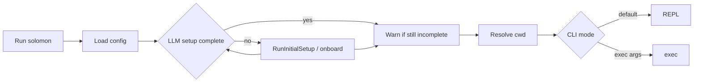

# Startup and CLI

## Purpose

Documents how the `solomon` binary boots, branches on subcommands, and constructs the interactive runtime.

## Packages and files

| Package / file | Responsibility |
|----------------|----------------|
| `cmd/solomon/main.go` | Entry: logging, CLI branches, REPL |
| `cmd/solomon/exec.go` | `exec` / `temp exec`, `--json` / `--jsonl`, headless config |
| `internal/agent/cievents` | CI event schema, JSONL/collector sinks, exit codes |
| `internal/config/exec_resolve.go` | TOML → env → env-file for machine exec |
| `internal/paths` | `SolomonHome()` → `~/.solomon` |
| `internal/config` | Load/save TOML, onboard setup, provider resolve, model pick |
| `internal/project` | `Resolve(wd)` → canonical root + 64-char hex id |
| `internal/logging` | File logs under `~/.solomon/logs` |
| `internal/chatstore` | Empty or loaded `Session` passed into runtime |
| `internal/agent/runtime` | `NewRuntime`, `InitMCP`, `Run`, `RunPromptOnce` |

## Key functions

| Function | File | Behavior |
|----------|------|----------|
| `main` | `cmd/solomon/main.go` | Init logging; `add`/`remove`; early `exec` path; initial setup + REPL |
| `runExecCLI` | `cmd/solomon/exec.go` | One-shot exec with optional machine output |
| `config.ResolveExecConfig` | `internal/config/exec_resolve.go` | Headless credentials for `--json`/`--jsonl` |
| `paths.SolomonHome` | `internal/paths/paths.go` | User data root |
| `config.RunInitialSetup` | `internal/config/onboard_setup.go` | First-run / incomplete LLM setup (required provider) |
| `config.RunOnboardWizard` | `internal/config/onboard.go` | Interactive `/onboard` wizard: OpenAI or Anthropic Compatible API (optional skips on re-run) |
| `config.NeedsOnboard` | `internal/config/onboard.go` | True when provider, API key, or model is missing |
| `config.ResolveProvider` | `internal/config/config.go` | Active provider from `current.*` |
| `project.Resolve` | `internal/project/project.go` | Map cwd → `(root, hex)` |
| `agentruntime.NewRuntime` | `runtime/core.go` | OpenAI client, default `Mode: "build"` |
| `Runtime.InitMCP` | `runtime/mcp.go` | Start MCP manager from config |
| `Runtime.Run` | `runtime/repl.go` | Interactive loop |
| `Runtime.RunPromptOnce` | `runtime/core.go` | Single user message + turns |

## Startup flow

## CLI branches (early exit)

Before initial setup, `main` handles:

- `solomon add ...` → `commands.Add` with `project.Resolve` deps
- `solomon remove skill <name>` → `commands.Remove`
- `solomon exec` / `solomon temp exec` → `runExecCLI` (human or `--json` / `--jsonl`; readline skipped in machine mode)

After runtime construction (REPL path only):

- default — `Runtime.Run`
- REPL `/temp` — ephemeral in-memory chat ([`commands.TempChat`](../../internal/agent/commands/resume.go))

## Session construction at boot

`main` allocates an empty `chatstore.Session` (placeholder checkpoint fields, empty messages). The REPL or `/resume` loads or assigns ids; see [Sessions and storage](sessions-and-storage.md).

## Extension points

- New global CLI subcommands: add branch in `main` before REPL setup (mirror `add`/`remove` pattern with `commands.Deps`).
- Boot-time defaults: `NewRuntime` and `config.Root` fields.

## Related code

- [`cmd/solomon/main.go`](../../cmd/solomon/main.go)
- [`internal/config/config.go`](../../internal/config/config.go)
- [`internal/project/project.go`](../../internal/project/project.go)

## See also

- [Runtime and REPL](runtime-and-repl.md)
- [Configuration](../user-guide/configuration.md)
- [Building and releases](../development/building-and-releases.md)
