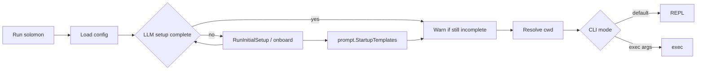

# Startup and CLI

## Purpose

Documents how the `solomon` binary boots, branches on subcommands, and constructs the interactive runtime.

## Packages and files

| Package / file | Responsibility |
|----------------|----------------|
| `cmd/solomon/main.go` | Entry: logging, CLI branches, REPL |
| `cmd/solomon/exec.go` | `exec` / `temp exec`, `--json` / `--jsonl`, headless config |
| `cmd/solomon/serve.go` | `serve` — HTTPS Responses API daemon |
| `internal/server/` | HTTP server: auth, conversations, responses, SSE |
| `internal/agent/cievents` | CI event schema, JSONL/collector sinks, exit codes |
| `internal/config/exec_resolve.go` | TOML → env → env-file for machine exec |
| `internal/prompt` | Embedded `.tmpl` defaults, disk store, startup SHA review |
| `internal/paths` | `SolomonHome()` → `~/.solomon`, `PromptTemplatesDir()` |
| `internal/config` | Load/save TOML, onboard setup, provider resolve, model pick |
| `internal/project` | `Resolve(wd)` → canonical root + 64-char hex id |
| `internal/logging` | File logs under `~/.solomon/logs` |
| `internal/chatstore` | Empty or loaded `Session` passed into runtime |
| `internal/agent/runtime` | `NewRuntime`, `InitMCP`, `Run`, `RunPromptOnce` |

## Key functions

| Function | File | Behavior |
|----------|------|----------|
| `main` | `cmd/solomon/main.go` | Init logging; `add`/`remove`; early `exec` path; initial setup + REPL |
| `runExecCLI` | `cmd/solomon/exec.go` | One-shot exec with optional machine output |
| `config.ResolveExecConfig` | `internal/config/exec_resolve.go` | Headless credentials for `--json`/`--jsonl` |
| `prompt.InstallTemplates` | `internal/prompt/install.go` | SHA review + sync before writing `prompts/templates/` (`make install`) |
| `paths.PromptTemplatesDir` | `internal/paths/paths.go` | `~/.solomon/prompts/templates/` |
| `config.RunInitialSetup` | `internal/config/onboard_setup.go` | First-run / incomplete LLM setup (required provider) |
| `config.RunOnboardWizard` | `internal/config/onboard.go` | Interactive `/onboard` wizard: OpenAI or Anthropic Compatible API (optional skips on re-run) |
| `config.NeedsOnboard` | `internal/config/onboard.go` | True when provider, API key, or model is missing |
| `config.ResolveProvider` | `internal/config/config.go` | Active provider from `current.*` |
| `project.Resolve` | `internal/project/project.go` | Map cwd → `(root, hex)` |
| `agentruntime.NewRuntime` | `runtime/core.go` | OpenAI client, default `Mode: "agent"` |
| `Runtime.InitMCP` | `runtime/mcp.go` | Start MCP manager from config |
| `Runtime.Run` | `runtime/repl_run.go` + `runtime/repl/` | Interactive loop |
| `Runtime.RunPromptOnce` | `runtime/core.go` | Single user message + turns |

## Startup flow



## CLI branches (early exit)

Before initial setup, `main` handles:

- `solomon add ...` → `commands.Add` with `project.Resolve` deps
- `solomon remove skill <name>` → `commands.Remove`
- `solomon exec` / `solomon temp exec` → `runExecCLI` (human or `--json` / `--jsonl`; readline skipped in machine mode; **no** `StartupTemplates` — use interactive REPL to accept template edits)
- `solomon serve` → `runServeCLI` (HTTPS daemon; OpenAI Responses API; see [Configuration](../user-guide/configuration.md#server-http-daemon))

### `solomon serve`

Runs a foreground HTTPS server for the current project workspace. Default bind: `127.0.0.1:8443` (override with `[server]` in `config.toml` or `--bind`).

| Flag | Effect |
|------|--------|
| `--bind HOST:PORT` | Listen address |
| `--static-dir PATH` | Serve a web UI build |
| `--no-static` | API only |

First start prints a one-time bootstrap token. Exchange it via `POST /v1/auth/bootstrap`, then use `Authorization: Bearer <token>` on all `/v1/*` routes. Token issue endpoints return both `token` (secret) and `id` (stable session id for revoke).

**Revoke token** (logout):

| Step | Endpoint | Notes |
|------|----------|-------|
| Revoke | `POST /v1/auth/token/revoke` | Body: `{"id":"<your-token-id>"}`. Bearer required. Only the matching session can revoke itself. Revoking the last active token is allowed; issue a new bearer via passkey login or a fresh bootstrap when no sessions remain active. |

**Passkey auth** (WebAuthn):

| Step | Endpoint | Notes |
|------|----------|-------|
| Register begin | `POST /v1/auth/passkey/register/begin` | Returns `session_id` + `publicKey` (credential creation options). First passkey is open; additional passkeys require an existing bearer. |
| Register finish | `POST /v1/auth/passkey/register/finish` | Body: `{"session_id","credential"}` where `credential` is the browser `PublicKeyCredential` JSON. Issues a bearer on the first passkey when no session tokens exist yet. |
| Login begin | `POST /v1/auth/passkey/login/begin` | Discoverable login; returns `session_id` + `publicKey`. |
| Login finish | `POST /v1/auth/passkey/login/finish` | Body: `{"session_id","credential"}`; returns a new bearer `slm_...`. |

RP ID and allowed origins are derived from the request `Host` and TLS (HTTPS only in production). Clients must call the API from the same origin the browser uses for WebAuthn.

**Session locking:** the daemon acquires an exclusive `flock` on the active conversation file while handling a turn. The interactive REPL holds the same lock for the loaded chat; if another process holds it, REPL input and `/resume` fail with a clear error instead of corrupting the session.

**Response persistence:** completed turns are written to `~/.solomon/server/responses/<project-id>/<response-id>.json` and kept in memory until daemon restart. `GET /v1/responses/{id}` returns the final snapshot (polling for `background: true`). `GET /v1/responses/{id}?stream=true&starting_after=N` replays SSE events from memory or disk. Live reconnect during an in-progress turn uses the same query on the active response id.

Only **one turn** may run at a time per daemon (`409 turn_active`). Session file locks are held for the full turn, including `background: true` jobs, until the turn completes.

TLS uses a self-signed cert under `~/.solomon/server/certs/` (SHA256 fingerprint printed at startup). For production/VPN, pin the fingerprint in clients.

**systemd** (example):

```ini
[Unit]
Description=Solomon agent server
After=network.target

[Service]
Type=simple
WorkingDirectory=/path/to/project
ExecStart=/usr/local/bin/solomon serve
Restart=on-failure

[Install]
WantedBy=multi-user.target
```

**launchd** (example plist `ProgramArguments`: `/usr/local/bin/solomon`, `serve`; set `WorkingDirectory` to the project root).


After initial setup on the **interactive REPL path**, `prompt.StartupTemplates` runs before the session loop: copies missing `.tmpl` files, then prompts only when on-disk content diverges from a saved `[prompt_templates]` SHA (tampering after accept). Template upgrades from a new binary are synced during `make install` via `solomon templates install` (SHA check before writing files). See [Configuration](../user-guide/configuration.md#prompt_templates-system-prompt-templates).

After runtime construction (REPL path only):

- default — `Runtime.Run`
- REPL `/temp` — ephemeral in-memory chat ([`commands.TempChat`](../../internal/agent/commands/resume.go))

## Session construction at boot

`main` allocates an empty `chatstore.Session` (placeholder checkpoint fields, empty messages). The REPL or `/resume` loads or assigns ids; see [Sessions and storage](sessions-and-storage.md).

## Extension points

- New global CLI subcommands: add branch in `main` before REPL setup (mirror `add`/`remove` pattern with `commands.Deps`).
- Boot-time defaults: `NewRuntime` and `config.Root` fields.

## Related code

- [`cmd/solomon/main.go`](../../cmd/solomon/main.go)
- [`internal/config/config.go`](../../internal/config/config.go)
- [`internal/project/project.go`](../../internal/project/project.go)

## See also

- [Runtime and REPL](runtime-and-repl.md)
- [Configuration](../user-guide/configuration.md)
- [Building and releases](../development/building-and-releases.md)
