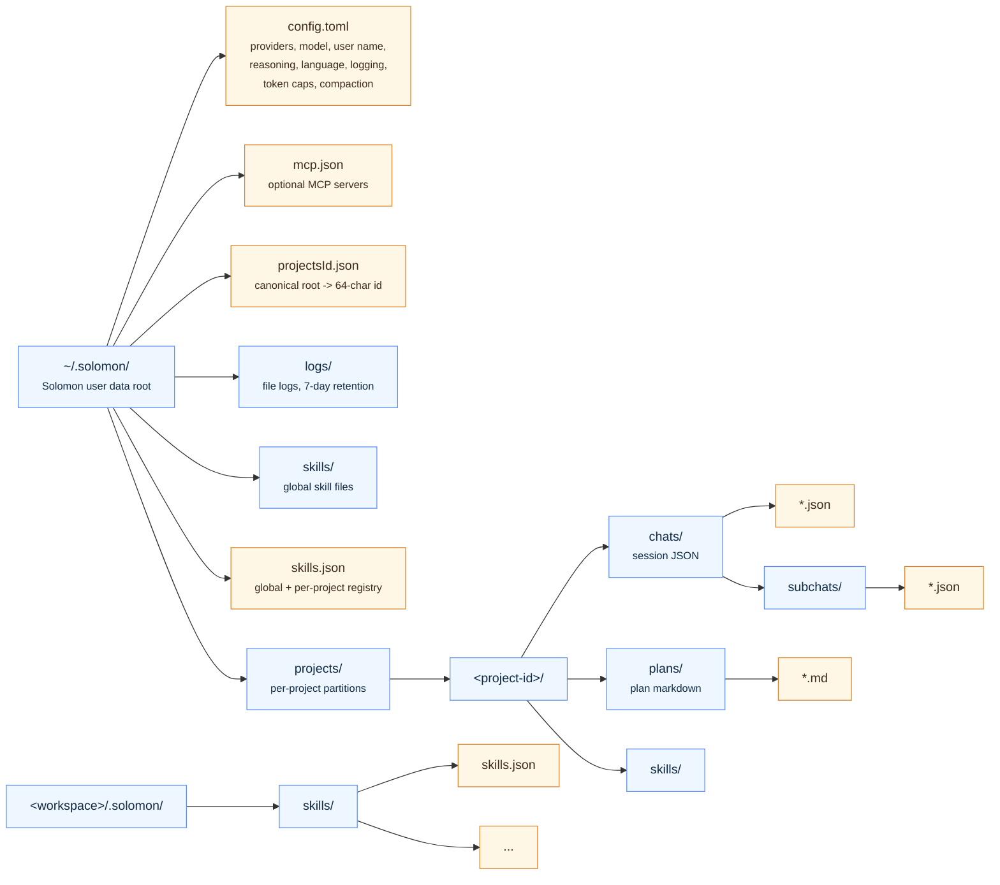

# Data layout

Solomon stores user data outside the repository under `~/.solomon`. Project-scoped data is keyed by the canonical working directory and grouped under a stable project id ([`project.Resolve`](../../internal/project/project.go)).

## Session files

Chat sessions live under `projects/<project-id>/chats/*.json`. Each file holds session id, title, timestamps, messages, tool calls, checkpoint fields, token usage, and image references. See [Sessions and storage](../architecture/sessions-and-storage.md).

## Plans

Plan documents created through plan-mode tools are stored under `projects/<project-id>/plans/*.md`.

## Skills

- Global: `~/.solomon/skills/` + `skills.json`
- Per project: `projects/<project-id>/skills/`
- Per workspace: `<workspace>/.solomon/skills/` with local `skills.json` mirror

Registry and install paths: [Skills and slash](../architecture/skills-and-slash.md).

## See also

- [Configuration](configuration.md)
- [Sessions and storage](../architecture/sessions-and-storage.md)
- [Checkpoints](../architecture/checkpoints.md)
