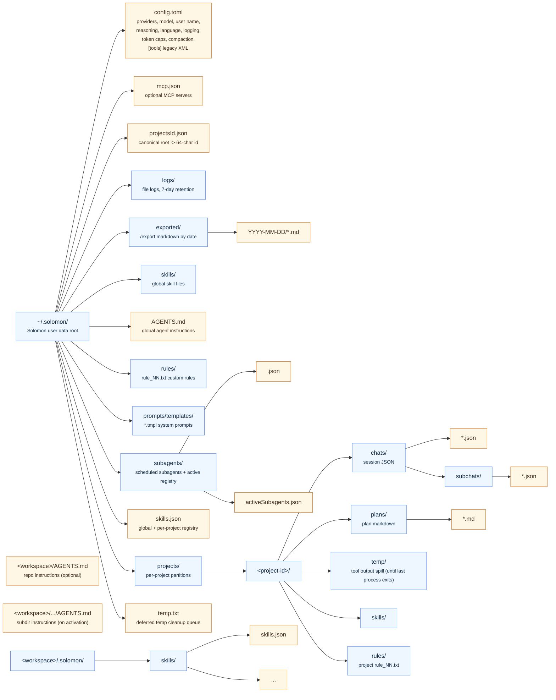

# Data layout

Solomon stores user data outside the repository under `~/.solomon`. Project-scoped data is keyed by the canonical working directory and grouped under a stable project id ([`project.Resolve`](../../internal/project/project.go)).

## Session files

Chat sessions live under `projects/<project-id>/chats/*.json`. Each file holds session id, title, timestamps, messages, tool calls, checkpoint fields, token usage, image references, and `activated_instruction_dirs` (subdirectory instruction paths active for that chat). Legacy tool settings are **not** stored per session — they live in global `config.toml` under `[tools]`. Old session JSON may still contain a deprecated `legacy_tools` field; it is ignored on load. See [Sessions and storage](../architecture/sessions-and-storage.md).

## Local server runtime

The detached local server writes lifecycle state to `~/.solomon/run/server/state.json` and its stdout/stderr log to `~/.solomon/logs/server/server.log`. The state file contains no configuration or user content; it is removed after a graceful `solomon server stop`. See [Local server](../architecture/server.md).

## Subagent files

Project subagent transcripts live under `projects/<project-id>/chats/subchats/<subchat-id>.json`. Scheduled subagents use `~/.solomon/subagents/<subchat-id>.json`. Both contain the nested messages and lifecycle metadata such as title, parent linkage, status, selected role, and reasoning effort. `~/.solomon/subagents/activeSubagents.json` is a small active-run registry used for background cancellation and startup reconciliation; it does not contain the transcript. See [Subagent persistence and lifecycle](../architecture/sessions-and-storage.md#subagent-persistence-and-lifecycle).

## Exported chats (`/export`)

Markdown exports from `/export` live under `~/.solomon/exported/{YYYY-MM-DD}/{basename}.md` by default, or under `[export].path` with the same date subdirectory layout. Files are self-contained transcripts (metadata header, readable message body, optional `## Images` appendix with base64 data URIs). Re-exporting the same chat on the same day creates `{basename}-1.md`, `{basename}-2.md`, … Solomon does not maintain a separate export index — “already exported today” checks scan for matching basenames in that date folder. Details: [Usage and commands — `/export`](usage-and-commands.md#export-chat-transcript).

## Project instructions and custom rules

| What | Where |
|------|--------|
| Global instructions | `~/.solomon/AGENTS.md` |
| Global custom rules | `~/.solomon/rules/rule_NN.txt` |
| Project custom rules | `~/.solomon/projects/<project-id>/rules/rule_NN.txt` |
| Repository instructions | `<workspace>/AGENTS.md` (or `CLAUDE.md` / `GEMINI.md` fallback in the same directory) |
| Subdirectory instructions | `<workspace>/<subdir>/AGENTS.md` (loaded into the prompt only after tool-driven activation in that session) |

Rules vs architectural instruction files: [Project instructions](project-instructions.md).

## Plans

Plan documents created through plan-mode tools are stored under `projects/<project-id>/plans/*.md`.

## Tool output spill (`temp/`)

When a tool result exceeds `[tool_output]` limits (defaults in config), Solomon writes the full payload under `projects/<project-id>/temp/` and returns a `---TRUNCATED---` block with `full output at <path>` in the tool result. Files in `temp/` are deleted when the **last** Solomon process exits; if other instances are still running, the project id is queued in `~/.solomon/temp.txt` until then. After a restart with no spill files left, use `readFile` with line ranges or re-run the tool. See [Agent turn pipeline](../architecture/agent-turn-pipeline.md#tool-output-limits).

## Skills

- Global (`/add ... global` or default): `~/.solomon/skills/` + `skills.json`
- Per project (`/add ... project`): `projects/<project-id>/skills/`
- Per workspace (`/add ... local`): `<workspace>/.solomon/skills/` with local `skills.json` mirror

npm `skills add` stages under `~/.agents/skills/`; Solomon copies into the scope above and removes npm cwd side-effects (`.agents/`, `skills-lock.json`) after a successful install.

Registry and install paths: [Skills and slash](../architecture/skills-and-slash.md). User guide: [Installing skills](usage-and-commands.md#installing-skills).

## Prompt templates

System prompt templates are installed under `~/.solomon/prompts/templates/` (`*.tmpl`). Accepted edits are tracked by SHA256 in `config.toml` under `[prompt_templates]`. See [Configuration — prompt_templates](configuration.md#prompt_templates-system-prompt-templates).

## See also

- [Configuration](configuration.md)
- [Project instructions](project-instructions.md)
- [Sessions and storage](../architecture/sessions-and-storage.md)
- [Checkpoints](../architecture/checkpoints.md)
